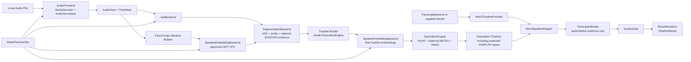
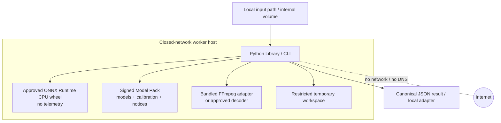
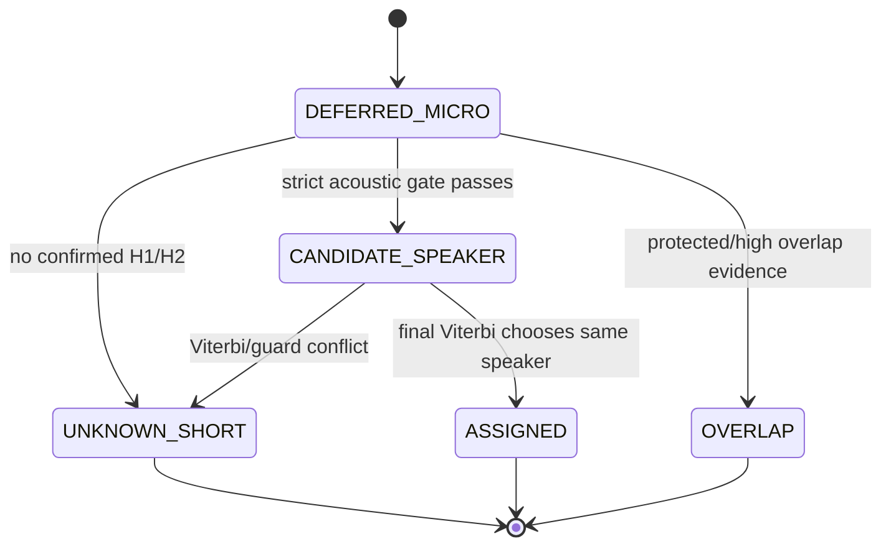
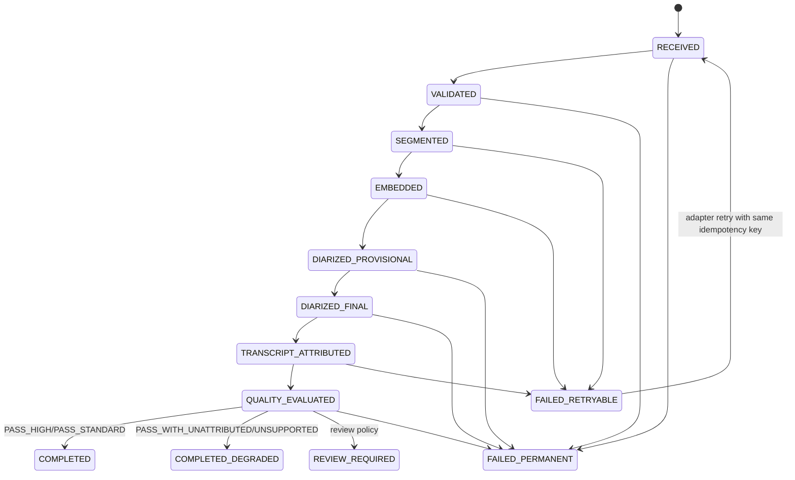

# 폐쇄망 CPU 기반 범용 1~2인 화자분리 라이브러리 SDD (V1)

| 항목 | 값 |
|---|---|
| 문서 ID | `SDD-SDDIAR-V1-001` |
| 상태 | **추천 설계 확정본 + development implementation 0.3.0** — macOS arm64 actual ONNX, Linux arm64 1-CPU proxy, Linux x86_64 wheel ingress 검증. calibration, 라이선스, four-target release는 각 gate 전까지 확정 사실이 아니다. |
| 작성일 / 구현 갱신 | 2026-08-25 / 2026-08-26 |
| 대상 | macOS arm64/x64, Windows x64, Linux x64 / CPU 8코어·RAM 8GB / 폐쇄망 |
| 핵심 원칙 | `finalize()` 이후의 보수적 귀속, `UNKNOWN` 보존, model pack fail-closed, 외부 역할·신원 추론 분리 |

> 구현 갱신: `IMPLEMENTATION_STATUS.md`와 `experiments/260824_clova_proxy/RESULT.md`가 현재 evidence의 기준이다. 이 SDD 안의 “현재 미반입/미측정” 문구는 작성 시점 snapshot으로 읽는다. 개발 candidate는 실제 Silero/WeSpeaker CPU ONNX, strict Kaldi-compatible FBank, 고수준 API/CLI, macOS arm64 hash-locked wheelhouse와 3,171.732초 전체 실행까지 도달했다. Quality Gate는 signed independent calibration이 없어 여전히 `REVIEW_REQUIRED`이며, 아래 P3~P6 release 조건은 완화하지 않는다.

## 문서 읽는 법과 근거 상태

각 항목의 등급은 다음 다섯 값과 calibration 표식을 사용한다.

| 표기 | 의미 |
|---|---|
| `MUST` | V1 출시 전 반드시 구현·검증한다. |
| `SHOULD` | V1에서 권장한다. 제외하면 명시적인 품질/기능 저하를 남긴다. |
| `MAY` | 선택 구현이다. 기본 경로의 전제조건이 아니다. |
| `FUTURE` | V1 이후, 실패 분석과 별도 승인 뒤 검토한다. |
| `OUT_OF_SCOPE` | V1이 지원하거나 보장하지 않는다. |
| `TBD_CALIBRATION` | 값 자체는 아직 검증되지 않았으며, 버전 고정된 calibration 데이터에서 결정한다. |

이 문서는 다음 네 종류의 정보를 의도적으로 분리한다.

1. **확정 요구사항**: 본 요청에서 주어진 운영·안전 요구사항이다.
2. **추천 설계**: 본 SDD가 선택한 V1 구현 방법이다.
3. **검증 가설**: 실제 평가 데이터로 확인해야 하는 모델, threshold, 성능 목표다.
4. **외부 사실**: 아래 공식 출처로 확인한 사실만 포함한다. 논문 또는 모델의 benchmark는 이 시스템의 성능 근거가 아니다.

외부 사실 확인 기준일은 2026-08-25이다.

- ONNX Runtime 공식 배포본은 telemetry가 기본 활성화이며, build 시 `--no_telemetry`로 제거할 수 있다. 따라서 본 SDD의 엄격한 폐쇄망 릴리스는 공식 PyPI wheel을 그대로 사용하지 않고, company-built 또는 audited vendor telemetry-free wheel을 반입한다. [ORT Privacy](https://raw.githubusercontent.com/microsoft/onnxruntime/v1.29.0/docs/Privacy.md)
- 확인일의 PyPI `onnxruntime` 1.29.0 CPU wheel에는 Windows x64, Linux x64, macOS arm64가 있었으나 macOS x64는 없었다. Intel Mac은 company 또는 vendor의 approved x86_64 wheel이 필요하다. 이 artifact inventory는 P5에서 재확인한다. [PyPI release metadata](https://pypi.org/pypi/onnxruntime/json)
- WeSpeaker는 Apache-2.0 코드와 ONNX runtime model 경로를 제공하며, 해당 문서는 VoxCeleb 기반 pretrained weight가 VoxCeleb의 CC-BY-4.0 조건을 따른다고 적는다. 이는 **코드 라이선스가 weight 재배포 승인을 대신하지 않음**을 뜻한다. [WeSpeaker pretrained models](https://github.com/wenet-e2e/wespeaker/blob/master/docs/pretrained.md?plain=1)

---

# 1. 결론과 추천 설계

## 1.1 결론

**V1은 `오프라인 · CPU · 1~2 주화자 · 전체 파일 finalization · 보수적 귀속` 라이브러리로 한정한다.** 기본 파이프라인은 VAD 기반 speech region, 제한된 tracklet, ONNX speaker embedding, 가중 H1/H2 가설 비교, deferred MICRO 재평가, tracklet 수준 Viterbi, 단어 구간 전체 evidence 기반 귀속, 규칙 기반 Quality Gate 순서다.

다음은 V1에서 하지 않는다.

- 일반 회의용 다화자 clustering, 전역 affinity matrix, 음원분리, 실시간 품질 SLA
- 자체 VAD/SCD/OSD/embedding 모델 학습
- 학습 기반 파일 품질 모델
- Python/ONNX Runtime 프로파일링 이전의 Rust/C++ 재작성
- 화자 ID에서 역할·실명·다른 녹음의 동일인으로 이어지는 추론

이 선택은 8코어·8GB에서 구현 가능성을 높이는 대신, 불확실한 구간을 `UNKNOWN`, `OVERLAP`, `OTHER`로 남긴다. 이는 coverage 부족이 아니라 안전 설계다.

## 1.2 V1의 추천 구조

```text
사전 검증된 model pack + approved telemetry-free ORT wheel
        │
로컬 파일 → Audio Frontend → Segmentation Evidence → Diarization Engine
              (decode/timewarp)     (VAD/SCD/OSD)     (H1/H2/finalize)
                                                          │
caller-supplied words / 내부 STT adapter ──→ Word Mapper ──→ Quality Gate
                                                          │
                                      Generic Conversation Result
                                    ├─ speaker-aware transcript
                                    ├─ speaker-neutral transcript
                                    └─ summary-use policy / reason codes
```

### 필수 설계 결정

| 결정 | 등급 | V1 선택 |
|---|---|---|
| 처리 모델 | `MUST` | 두 pass: 증거 수집 후 whole-file finalization. 온라인 중간 결과는 SLA 대상이 아니다. |
| 화자 수 | `MUST` | H1(주화자 1)과 H2(주화자 2)를 비교한다. `max_speakers=2`는 H2 강제가 아니다. |
| 주 화자 상태 | `MUST` | H2가 통과한 안정 anchor만으로 만든 `stable_anchor_centroid` + 제한된 `recent_centroid`를 사용한다. |
| 불확실성 | `MUST` | score/margin/gate가 부족하면 `UNKNOWN`; overlap evidence가 있으면 `OVERLAP`; 반복적 비주화자 증거는 `OTHER`다. |
| MICRO | `MUST` | Pass 1에서는 보류하며 화자 생성/centroid 갱신에 절대 사용하지 않는다. |
| 중첩 | `MUST` | source separation은 하지 않는다. overlap 단어는 `OVERLAP_UNATTRIBUTED`다. |
| embedding runtime | `MUST` | pre-bundled ONNX model + telemetry-free private ONNX Runtime CPU build. |
| Quality Gate | `MUST` | 학습 모델이 아닌 versioned rule set. calibration profile이 없으면 speaker-aware PASS를 내지 않는다. |
| `condition_prototypes` | `FUTURE` | V1 기본값은 0개다. P2 ablation이 stable/recent 방식의 실패를 보일 때만 최대 2개를 검토한다. |
| micro-turn aggregation | `FUTURE` | V1 기본값은 비활성이다. 독립 MICRO 합산은 별도 precision/false-pass 검증 뒤에만 도입한다. |
| GPU EP | `MAY` | CPU 결과 계약·model pack을 바꾸지 않는 optional backend다. GPU 전용 모델은 허용하지 않는다. |

## 1.3 현실성 및 가장 큰 실패 위험

V1은 **지원 envelope** 안에서만 품질을 인증한다. 현재 확인된 실제 AI Hub 3건의 비합침 관찰과 합성 여성 2인 합침 사례는 P0 regression fixture로 유용하지만, 일반 정확도·안정성·남성 2인 성능의 증거는 아니다.

가장 큰 실패 위험은 다음 순서다.

1. 화자 embedding의 8 kHz 전화 음성, 한국어 실내 녹음, 유사 화자에 대한 분리도가 충분하지 않은 위험
2. 연속 발화에서 SCD가 불충분해 두 화자가 하나의 tracklet에 섞이는 위험
3. OSD가 없거나 약해 overlap이 숨겨진 채 귀속되는 위험
4. 매우 짧은 맞장구를 과감히 붙여 precision이 무너지는 위험
5. 변환 모델, model weight, codec/ORT wheel의 라이선스·telemetry·재배포 조건을 늦게 확인하는 위험

따라서 P0~P2는 성능 홍보 단계가 아니라 이 위험을 계량하는 engineering alpha다. P3 calibration과 P5 offline release gate 전에는 운영 품질을 주장하지 않는다.

---

# 2. Scope와 Non-goals

## 2.1 In scope

| 범위 | 등급 | 설명 |
|---|---|---|
| 파일 기반 batch 처리 | `MUST` | 녹음 전체를 받은 뒤 최종 결과를 확정한다. 내부 chunk 처리는 가능하다. |
| 주화자 1 또는 2명 | `MUST` | 대부분 교대 발화, 두 화자 모두 일정량의 독립 발화가 존재하는 경우다. |
| 일반적 화자 label | `MUST` | `SPEAKER_00`, `SPEAKER_01`, `UNKNOWN`, `OVERLAP`, `OTHER`, `NON_SPEECH`만 코어 label로 쓴다. |
| STT 교체성 | `MUST` | caller-supplied word timeline, 내부망 STT, 별도 alignment backend를 교체할 수 있다. |
| speaker-aware / neutral 결과 | `MUST` | 두 결과와 summary-use policy를 동시에 낸다. |
| 세션 내 human correction | `MAY` | 사람이 확인한 구간을 evidence로 넣고 해당 **세션**의 UNKNOWN만 재평가한다. |
| 기존 pyannote adapter | `SHOULD` | baseline/회귀 비교용이다. 새 CPU core를 pyannote 실행 래퍼로 만들지 않는다. |

## 2.2 Non-goals 및 명시적 비지원

| 항목 | 등급 | 처리 정책 |
|---|---|---|
| 긴 mono 동시발화의 두 음성 복원 | `OUT_OF_SCOPE` | source separation을 하지 않는다. `OVERLAP` 또는 `UNSUPPORTED`로 보존한다. |
| 안정적 3명 이상 회의 | `OUT_OF_SCOPE` | `OTHER`/`REVIEW_REQUIRED`/`UNSUPPORTED`; `SPEAKER_02`를 만들지 않는다. |
| 매우 유사한 음색의 자동 구분 | `OUT_OF_SCOPE` | 모호하면 H2를 승인하지 않고 `UNKNOWN`/review로 간다. |
| 한 화자가 MICRO만 하는 세션 | `OUT_OF_SCOPE` | 두 번째 안정 화자를 MICRO만으로 생성하지 않는다. |
| 방송/TV/재생음 반복 | `OUT_OF_SCOPE` | `OTHER` 또는 profile-out-of-scope로 처리한다. |
| 심한 clipping/echo/crosstalk/packet loss | `OUT_OF_SCOPE` | 가능한 중립 transcript만 남기고 `UNSUPPORTED` 또는 review다. |
| 역할·실명 자동 확정 | `OUT_OF_SCOPE` | 텍스트·말투·화자분리 결과는 authoritative binding 근거가 아니다. |
| cross-recording 화자 추적 | `OUT_OF_SCOPE` | speaker centroid/embedding은 파일 세션을 넘겨 보관·재사용하지 않는다. |
| streaming final SLA | `OUT_OF_SCOPE` | provisional 결과를 노출할 수 있어도 품질 보장은 `finalize()` 뒤에만 있다. |
| Kubernetes, broker, autoscaling | `OUT_OF_SCOPE` | adapter 또는 운영 플랫폼의 책임이다. |

## 2.3 Lightning-SimulWhisper 경계

요청에서 언급한 Lightning-SimulWhisper는 diarization 기능이 없고 PolyForm Noncommercial 조건 때문에 코드, 포크, dependency, 구현 구조 재사용 대상으로 삼지 않는다. V1은 VAD 기반 계산 절감·streaming buffer·word timeline 같은 일반 원칙만 독립적으로 설계한다. 이 문서는 해당 프로젝트의 최신 상태나 라이선스를 독립 검증한 사실로 취급하지 않는다.

---

# 3. 요구사항

## 3.1 기능·안전·비기능 요구사항

| ID | 등급 | 요구사항 | 검증 ID |
|---|---|---|---|
| `FR-INGEST-001` | `MUST` | 입력을 검증·decode하고 모든 최종 좌표를 원본 source timebase의 `int64` microseconds로 반환한다. | `TEST-TIME-001` |
| `FR-INGEST-002` | `MUST` | 허용하지 않은 URI, container, codec, timebase는 외부 fallback 없이 fail closed한다. | `TEST-DECODE-001` |
| `FR-DIAR-001` | `MUST` | H1과 H2를 비교하며 H2를 강제하지 않는다. | `TEST-HYP-001` |
| `FR-DIAR-002` | `MUST` | 품질 SLA는 final 결과에만 적용하고 모든 label은 세션 내 의미 없는 speaker ID다. | `TEST-FINAL-001` |
| `FR-DIAR-003` | `MUST` | evidence가 불충분한 speech를 특정 화자에게 강제하지 않는다. | `TEST-ATTR-001` |
| `SAFE-ATTR-001` | `MUST` | UNKNOWN/OVERLAP/OTHER 및 해당 word/turn 상태를 summary adapter까지 보존하며 역할·주장을 강제 귀속하지 않는다. | `TEST-ATTR-001`, `TEST-RESULT-001` |
| `FR-MICRO-001` | `MUST` | MICRO는 보류 후 anchor 확정 뒤에만 재평가하며 centroid 갱신/새 화자 생성에 쓰지 않는다. | `TEST-MICRO-001` |
| `FR-OVERLAP-001` | `MUST` | source separation을 하지 않고 overlap 단어를 단일 화자에게 귀속하지 않는다. | `TEST-OVERLAP-001` |
| `FR-STT-001` | `MUST` | TranscriptBackend와 WordTimelineProvider를 교체할 수 있고, chunk-local time을 source time으로 변환한다. | `TEST-TIME-002` |
| `FR-STT-002` | `MUST` | word 구간 전체 speaker evidence로 귀속하며 경계/overlap 단어는 보류한다. | `TEST-WORD-001` |
| `FR-BIND-001` | `MUST` | participant/role binding은 diarization core와 분리하고 authoritative evidence 없이는 생성하지 않는다. | `TEST-BIND-001` |
| `FR-QUAL-001` | `MUST` | 파일 상태, speaker count 상태, summary mode, reason code, 측정 metric을 반환한다. | `TEST-QUAL-001` |
| `FR-RESULT-001` | `MUST` | speaker-aware와 speaker-neutral transcript를 모두 반환 가능하게 한다. | `TEST-RESULT-001` |
| `FR-CORR-001` | `MAY` | human-confirmed session segment로 UNKNOWN을 재평가하는 correction API를 제공한다. | `TEST-CORR-001` |
| `NFR-CPU-001` | `MUST` | 8코어·8GB profile에서 worker당 동시 audio job은 1개이며 thread oversubscription을 피한다. | `PERF-CPU-001` |
| `NFR-MEM-001` | `MUST` | 60분 이상 파일을 bounded chunk/buffer로 처리하고 peak process-tree RSS를 기록한다. | `PERF-MEM-001` |
| `NFR-OFFLINE-001` | `MUST` | runtime network, DNS, auto download, cache 의존, telemetry, update check, URL fallback을 하지 않는다. | `TEST-OFFLINE-001` |
| `NFR-XPLAT-001` | `MUST` | 네 플랫폼에서 동일 Python API 및 결과 schema를 제공한다. | `TEST-XPLAT-001` |
| `NFR-OBS-001` | `MUST` | 일반 운영 log/metric에 raw audio, STT 원문, raw embedding을 남기지 않는다. | `TEST-PRIV-001` |
| `NFR-PACK-001` | `MUST` | manifest, model hash, runtime compatibility, signature가 맞지 않으면 시작 또는 inference를 거부한다. | `TEST-PACK-001` |
| `NFR-INTEG-001` | `SHOULD` | core는 GenOS, job scheduler, STT service를 알지 않고 adapter가 연결한다. | `TEST-INTEG-001` |
| `GOV-CAL-001` | `MUST` | threshold는 calibration profile/data/model/scorer hash와 함께 versioning한다. | `TEST-CAL-001` |
| `LIC-SBOM-001` | `MUST` | code, weights, training data terms, conversion, native binary, codec, wheel을 별 component로 추적한다. | `TEST-SBOM-001` |
| `FUT-NATIVE-001` | `FUTURE` | profiling 전 native rewrite를 강제하지 않는다. | `ADR-008` |
| `FUT-LEARN-001` | `FUTURE` | 자체 model 학습과 learned Quality Gate는 baseline 실패 분석 후에만 검토한다. | `ADR-008` |

## 3.2 Calibration register

아래 값은 기본 config에 존재할 수 있으나 **release threshold가 아니다**. 모든 값은 `calibration_profile_id` 없이는 PASS 판정에 사용하지 않는다.

| ID | 대상 | 결정 방법 |
|---|---|---|
| `CAL-TRK-001` | ANCHOR/SUPPORT/MICRO 유효 speech 길이, VAD merge/split gap | supported+challenge calibration set의 merge/over-split/RTF trade-off |
| `CAL-HYP-001` | H1/H2 gain, separation, min anchor/duration, stability | unsafe complete merge·false H2 제약 하 coverage 최소화 |
| `CAL-ASSIGN-001` | 절대 assignment score, 1·2위 margin, UNKNOWN cost | word/tracklet unsafe attribution 제약 |
| `CAL-SEQ-001` | Viterbi transition/short-switch/long-gap cost | speaker change 및 over-smoothing 분석 |
| `CAL-MICRO-001` | MICRO 임계값과 temporal prior 상한 | MICRO precision 우선 risk-coverage curve |
| `CAL-OVERLAP-001` | OSD threshold와 high/degraded/unsupported overlap band | overlap forced assignment 및 false PASS 제약 |
| `CAL-QUALITY-001` | Quality Gate rule bands | release-holdout을 보지 않은 calibration set에서 false accept 제약 |
| `CAL-MAP-001` | word evidence coverage 및 boundary-crossing band | word-speaker precision/coverage 분리 평가 |

---

# 4. Supported Operating Envelope

| 분류 | 입력 조건 | 결과·요약 정책 |
|---|---|---|
| **Supported** | 주화자 1~2명, 각 화자에 충분한 clean independent speech, 대부분 교대 발화, 낮은 overlap, 허용 가능한 음질, 사전 승인된 source-rate/profile | calibration rule을 통과하면 `PASS_HIGH` 또는 `PASS_STANDARD`; speaker-aware transcript/summary 가능 |
| **Degraded** | 짧은 overlap, 일부 MICRO/UNKNOWN, 약한 음향 drift, known 8 kHz profile, 또는 완전한 OSD coverage가 없는 제한 profile | `PASS_WITH_UNATTRIBUTED` 또는 `REVIEW_REQUIRED`; neutral transcript는 보존, speaker-aware summary는 제한/금지 |
| **Unsupported** | 긴 overlap, 안정적 3명 이상, MICRO-only second speaker, severe audio damage, 반복 재생음, calibrated profile 바깥 source-rate/codec | `UNSUPPORTED`; decode/STT가 가능하면 neutral transcript만 권장 |

### Label과 파일 상태의 구분

| 종류 | 값 | 의미 |
|---|---|---|
| diarization span label | `SPEAKER_00`, `SPEAKER_01` | 해당 세션에서만 유효한 안정 주화자 |
| diarization span label | `UNKNOWN` | 증거 부족 또는 내부 `UNKNOWN_SHORT` |
| diarization span label | `OVERLAP` | overlap evidence가 있어 단일 화자 배정을 금지한 speech |
| diarization span label | `OTHER` | 선택된 주화자와 반복적으로 맞지 않는 speech. 제3 화자 식별은 아니다. |
| diarization span label | `NON_SPEECH` | 음성 외 구간. 기본 출력에서는 긴 gap materialization을 생략할 수 있다. |
| word attribution state | `OVERLAP_UNATTRIBUTED` | STT word가 overlap에 걸려 어느 speaker에도 귀속되지 않음 |
| file state | `REVIEW_REQUIRED` | label이 아니라 사람 확인/요약 정책 상태 |

---

# 5. 시스템 아키텍처

## 5.1 Component diagram



`TrackletBuilder`, anchor selection, centroid update, hypothesis evaluator, sequence finalizer는 public microservice가 아니라 `DiarizationEngine` 내부의 테스트 가능한 함수다. 이 경계는 교체 가능한 외부 dependency만 plugin으로 남긴다.

## 5.2 Data flow 및 timebase

```mermaid
flowchart TD
  S[Source decoded PCM / original PTS] --> T[Source timebase: int64 us]
  S --> N[16 kHz processing AudioView]
  T --> W[TimeWarpSegment[]]
  N --> V[VAD]
  N --> P[fixed probe windows]
  P --> E[probe embeddings]
  V --> B[boundary/overlap evidence]
  E --> B
  B --> K[tracklets + protected overlap spans]
  K --> F[final embeddings + H1/H2/finalization]
  F --> D[Diarization spans in source us]
  X[STT chunk-local words] --> Y[Piecewise source-time mapping]
  W --> Y
  Y --> Z[Source-time Words]
  D --> M[range-overlap word mapping]
  Z --> M
```

모든 public span은 반열린 구간 `[start_us, end_us)` 이며 `0 <= start_us < end_us <= source_duration_us`를 만족한다. VAD로 speech를 잘라 이어 붙이는 내부 view의 시간은 절대 public으로 노출하지 않는다.

## 5.3 Deployment diagram



## 5.4 Whole-file sequence

```mermaid
sequenceDiagram
  participant A as Adapter/CLI
  participant P as Pipeline
  participant F as Frontend
  participant S as VAD/Segmentation
  participant E as Embedding Backend
  participant D as DiarizationEngine
  participant T as STT/Word Provider
  participant Q as QualityGate
  A->>P: run(AudioRequest)
  P->>P: verify signed model pack; reject mismatch
  P->>F: decode/normalize/timewarp
  F-->>P: AudioView + source metadata
  P->>S: infer VAD(view)
  S-->>P: VadEvidence
  P->>E: fixed probe windows
  E-->>P: ProbeEvidence
  P->>S: build evidence(VadEvidence, ProbeEvidence)
  S-->>P: SegmentationEvidence
  P->>D: build_tracklets(view, segmentation)
  D-->>P: TrackletBuildResult
  P->>E: final EmbeddingRegion[]
  E-->>P: final EmbeddingResult[]
  P->>D: diarize(build, embeddings)
  D-->>P: provisional hypothesis/assignments
  P->>D: finalize(provisional, protected spans, source duration)
  D-->>P: final diarization spans + assignments
  P->>T: supplied words or internal STT request
  T-->>P: source-time WordTimeline
  P->>P: map words; apply authoritative binding only
  P->>Q: evaluate metrics/rules
  Q-->>P: FileQualityReport
  P-->>A: schema-validated PipelineResult
```

---

# 6. 컴포넌트별 설계

## 6.1 경계 원칙

구현 단위는 Python package 내부 `Protocol`/순수 함수 경계다. 각 항목을 별도 프로세스·서비스·배포물로 만들지 않는다. `AudioFrontend`는 decoder와 normalizer를 묶고, `TranscriptBackend`는 필요하면 WordTimelineProvider를 내부 구현으로 묶는다. 반면 model runtime, STT, GenOS는 실제로 바뀔 수 있으므로 명시적 adapter 경계를 둔다.

| 컴포넌트 | 목적·책임 | 입력 → 출력 | 상태 / thread safety | V1 구현체·교체 경계 | 오류·성능·테스트 | 등급 |
|---|---|---|---|---|---|---|
| `ModelPackVerifier` | signed manifest와 model/wheel/native artifact를 검증하고 compatibility를 확인한다. | pack root, manifest → verified immutable registry | 프로세스 시작 시 1회; read-only, thread-safe | Ed25519-signed `manifest.json`; URL/auto-download 없음 | hash/signature/ops/runtime mismatch는 permanent failure; `TEST-PACK-*` | `MUST` |
| `AudioFrontend` | `MediaDecoder + AudioNormalizer`; local decode, channel policy, resampling, time warp 생성 | local path/bytes → `AudioSourceMetadata`, `AudioView[]` | request-local streaming buffers; 동시 호출 미보장 | bundled FFmpeg adapter 또는 approved native decoder; V1 16 kHz mono processing view | invalid codec/timebase/decoder 실패; buffer bound와 `TEST-TIME-*` | `MUST` |
| `VadBackend` | processing view의 frame speech posterior/evidence 생성 | PCM chunk → frame evidence | file-local Silero state; file 시작마다 reset | **Silero VAD ONNX**를 pre-bundled model로 직접 ORT 호출; fallback VAD는 package boundary만 교체 | inference/model 오류; `PERF-VAD-001`, speech fixture | `MUST` |
| `SegmentationBackend` | VAD region과 optional SCD/OSD evidence를 하나의 evidence timeline으로 정리 | VAD frames, **pre-tracklet `ProbeEvidence[]`** → boundaries/overlap evidence | stateless after input evidence 생성 | `RuleEvidenceSegmentation`이 V1 기본; pyannote segmentation adapter는 baseline/후속 후보 | evidence absence는 품질 risk이지 inference exception이 아님; `TEST-SEG-*` | `MUST` |
| `SpeakerEmbeddingBackend` | canonical audio를 model-specific feature로 만들고 L2-normalized embedding과 품질 flag를 낸다. | `EmbeddingRegion[]` → internal `EmbeddingResult[]` | ORT session is process-owned/read-only; job당 호출 직렬화 | **WeSpeaker `voxceleb_resnet34.onnx` FP32**를 P1 기본 candidate로 고정; model pack로 교체 | invalid contract/runtime/OOM; `TEST-EMB-*`, `PERF-EMB-*` | `MUST` |
| `DiarizationEngine` | tracklet, anchor, H1/H2, state, deferred MICRO, final Viterbi를 수행한다. | segmentation evidence + **final tracklet embeddings** → final spans/assignments/hypothesis | request-local mutable state; engine instance shared 금지 | 본 SDD의 제한된 weighted clustering 알고리즘 하나 | timebase invariant / internal numerical failure; `TEST-HYP-*`, `TEST-MICRO-*` | `MUST` |
| `TranscriptBackend` | caller word 또는 내부망 STT 결과를 받는다. | request/audio → transcript payload | adapter-defined; core network 없음 | `SuppliedWordsBackend`는 P0; internal service adapter는 P6 | typed `STT_BACKEND_FAILED`; retry는 adapter | `MUST` |
| `WordTimelineProvider` | STT word time이 없으면 alignment를 수행하고 chunk-local time/중복을 해소한다. | transcript/chunk mapping → `WordTimeline(words + provenance)` | stateless per request | supplied words pass-through; alignment adapter는 선택 | alignment failure는 degraded/typed error; `TEST-TIME-002` | `MUST` |
| `WordSpeakerMapper` | word range 전체와 final diarization evidence를 합쳐 보수적으로 귀속한다. | `WordTimeline` + spans → `AttributedWord[]` | pure function, thread-safe | one implementation | time-warp/boundary/overlap 강제귀속 방지; `TEST-WORD-*` | `MUST` |
| `ParticipantBinder` | authoritative evidence만 participant/role binding으로 바꾼다. | binding evidence + result → binding[] | pure, session-scoped | metadata/human-confirmed adapter; text heuristic 없음 | invalid evidence는 binding 없음; `TEST-BIND-*` | `MUST` |
| `QualityGate` | measured metrics와 versioned rule set을 파일 정책으로 바꾼다. | diagnostics + calibration → report | pure, thread-safe | `RuleBasedQualityGate` | calibration 누락은 review; `TEST-QUAL-*` | `MUST` |
| `ResultSerializer` | public Pydantic schema validation, canonical JSON, redaction을 수행한다. | internal result → `PipelineResult` JSON | pure, thread-safe | Pydantic v2 + canonical JSON | schema failure는 publish 금지; `TEST-CONTRACT-*` | `MUST` |

## 6.2 ModelPackVerifier

### 책임과 시작 순서

1. release root의 signed catalog를 library에 내장된 release public key로 확인한다.
2. 선택 platform의 wheel, native decoder, calibration, model 파일 각각의 SHA-256을 확인한다.
3. manifest가 선언한 ONNX opset, expected input/output, ORT build ID, execution provider와 실제 runtime을 비교한다.
4. model 한 개라도 빠졌거나 byte가 달라지거나 신뢰 사슬이 끊기면 **어떤 URL도 시도하지 않고** `MODEL_NOT_FOUND`, `MODEL_HASH_MISMATCH`, `MODEL_RUNTIME_INCOMPATIBLE`으로 끝낸다.

`manifest.json` 자신만 hash하는 방식은 manifest와 model이 함께 바뀌는 공격을 막지 못한다. 따라서 `manifest.sig` 및 trust root가 `MUST`다. 개발용 unsigned pack은 `development_mode`로만 명시적으로 허용하고 production profile에서는 거부한다.

## 6.3 AudioFrontend

### 입력 검증 및 channel policy

- `MUST`: `file://`, `http://`, `https://`, pipe URL, device URL를 API에서 거부한다. `AudioRequest.source`는 allowlisted local path 또는 caller-owned bytes/stream handle만 허용한다.
- `MUST`: decoder가 실제 container, codec, native sample rate, channel count, duration, decoded PTS를 먼저 보고한다.
- `MUST`: V1 processing view는 deterministic mono mixdown, 16 kHz PCM이다. 같은 source에는 항상 같은 mix gain/rounding을 적용한다.
- `SHOULD`: source가 2 channel이면 원 channel metadata와 energy statistics를 보존한다. channel number 자체는 speaker role/identity 근거가 아니다.
- `MAY`: 신뢰 가능한 channel metadata가 있는 dual-channel 녹음은 P6 `ParticipantBinder` evidence로 사용한다. core H1/H2 알고리즘을 channel label로 우회하지 않는다.
- `TBD_CALIBRATION`: clipping precheck, peak normalization policy, allowed loudness range, supported codec 목록.

### Timebase 규칙

`source timebase`는 decoder가 원본 파일에서 복원한 PCM/PTS 축이며, public time은 파일 시작 기준 microseconds다. audio view sample `v`를 source time으로 바꾸는 것은 하나 이상의 `TimeWarpSegment`의 affine mapping이다.

```text
source_us(v) = source_start_us
             + round_half_up((v - view_start_sample)
                             * (source_end_us - source_start_us)
                             / (view_end_sample - view_start_sample))
```

규칙은 다음과 같다.

- segments는 view 및 source 양쪽에서 엄격히 단조 증가한다.
- segment 끝은 다음 시작보다 작거나 같고 역행하면 안 된다.
- remux/VBR decode에서 decoder PTS가 불연속이면 gap을 숨기지 않고 별 segment로 남긴다.
- 내부 VAD concat이나 STT chunk-local sample은 `TimeWarpSegment`를 거쳐서만 public time으로 변환한다.
- conversion 뒤 span이 1 microsecond 이상이 되지 않거나 source duration을 벗어나면 `TIMEBASE_INVARIANT_VIOLATION`이다.

### 60분 이상 파일

전체 PCM을 메모리에 올리지 않는다. `decode_chunk_seconds`와 halo는 `TBD_PROFILING` config다. 기본 구현은 bounded sequential chunk + halo이며, 각 chunk 완료 뒤 raw PCM을 즉시 해제한다. VAD frame, tracklet/embedding evidence는 compact NumPy 배열 또는 bounded internal store로만 유지한다.

## 6.4 VadBackend와 SegmentationBackend

### V1 VAD 선택

V1 기본 VAD는 **Silero VAD ONNX**다. 사전 반입한 ONNX artifact를 ONNX Runtime으로 직접 실행하며 `torch.hub`, Hugging Face cache, 런타임 다운로드를 사용하지 않는다. upstream wrapper의 8/16 kHz 호출 단위와 state-reset contract는 model pack의 `input_contract`에 복제해 pin한다. [Silero VAD source](https://github.com/snakers4/silero-vad), [ONNX wrapper contract](https://github.com/snakers4/silero-vad/blob/master/src/silero_vad/utils_vad.py)

| VAD 정책 | 등급 | 세부 |
|---|---|---|
| VAD model file 및 code/weight terms를 별도 component로 audit | `MUST` | repository license만으로 weight 승인으로 간주하지 않는다. |
| file/chunk boundary state reset 및 halo dedup | `MUST` | 이전 파일의 recurrent state가 새 파일에 유입되지 않는다. |
| 8 kHz/16 kHz native input profile | `MUST` | source sample rate별 calibration profile을 분리한다. |
| VAD frame posterior/quality 저장 | `MUST` | raw audio가 아니라 frame-level numeric evidence만 request memory에서 유지한다. |
| WebRTC VAD fallback | `MAY` | audited platform native fallback이 필요한 경우에만 추가한다. Silero 결과와 동등하다고 가정하지 않는다. |

### V1 segmentation evidence

V1은 자체 SCD/OSD neural model을 학습하지 않는다. 기본 `RuleEvidenceSegmentation`은 아래만 이용한다.

1. VAD speech/non-speech 경계와 silence duration
2. quality-eligible 인접 probe embedding의 cosine discontinuity
3. optional source channel energy conflict
4. optional, pre-bundled SCD/OSD backend가 명시적으로 낸 evidence

#### Pass 1a — probe evidence는 tracklet 이전에 만든다

`ProbeEvidence`는 tracklet이 아니라 VAD-clean region 위의 fixed sliding source-time window다. pipeline은 먼저 VAD를 실행하고, VAD-clean speech coverage가 충분한 probe window를 생성한 뒤 같은 `SpeakerEmbeddingBackend`로 **probe-only embedding**을 뽑는다. 그 결과를 SegmentationBackend에 넘겨 adjacent discontinuity를 계산한다. 이로써 `segmentation → tracklet → embedding`의 순환이 없다.

```python
@dataclass(frozen=True, slots=True)
class ProbeEvidence:
    probe_id: str
    start_us: int
    end_us: int
    clean_speech_us: int
    vector: NDArray[np.float32]       # internal only
    quality: float
    left_vad_gap_us: int
    right_vad_gap_us: int

def collect_probe_evidence(view, vad, embedding_backend, cfg) -> Sequence[ProbeEvidence]:
    windows = fixed_sliding_clean_windows(view, vad, cfg.probe_window_us, cfg.probe_hop_us)
    return embed_and_filter_probe_windows(windows, embedding_backend, cfg)
```

probe window/hop, clean coverage, probe batch size는 `TBD_CALIBRATION`/`TBD_PROFILING`이다. Probe는 H1/H2 anchor, centroid update, public result에 사용하지 않고 **boundary evidence**에만 사용한다.

`adjacent embedding discontinuity`만으로 continuous speech 내부 화자 전환을 확정하지 않는다. V1 기본에서 split 조건은 **(VAD hard boundary 또는 approved SCD evidence) AND embedding discontinuity**다. 두 조건이 맞지 않는 tracklet 내부 불일치는 `MIXED_TRACKLET_SUSPECT`로 기록하고 anchor/centroid 갱신에서 제외한다.

| SCD/OSD 선택 | 등급 | 사용 위치 | 근거 상태 |
|---|---|---|---|
| VAD gap + probe discontinuity | `MUST` | V1 기본 boundary evidence | 추천 설계, 수치는 calibration 필요 |
| `pyannote/segmentation-3.0` adapter | `MAY` | baseline/OSD·SCD evidence A/B | 공식 card는 PyTorch 기본, gated access; native ONNX artifact와 weight redistribution은 V1 확정 사실이 아니다. [model card](https://huggingface.co/pyannote/segmentation-3.0) |
| 자체 multi-task VAD/SCD/OSD | `FUTURE` | P0~P2 failure analysis 후 | shared encoder 연구는 V1이 아니다. |

OSD coverage가 없는 profile은 `overlap_detection_coverage=NOT_EVALUATED`를 남긴다. 그 profile은 `PASS_HIGH`를 낼 수 없으며, 지원 envelope의 “낮은 overlap”이 검증되지 않았다면 `REVIEW_REQUIRED`가 된다. 이것은 overlap이 없다고 거짓 주장하지 않기 위한 보수 규칙이다.

## 6.5 SpeakerEmbeddingBackend

### 후보와 선택 결론

| 후보 | ONNX/입력 계약 | 라이선스·provenance 상태 | V1 판단 |
|---|---|---|---|
| **WeSpeaker ResNet34 `voxceleb_resnet34.onnx`** | upstream recipe가 16 kHz/80-bin FBank/25 ms/10 ms/256-D를 제시한다. **실제 downloaded ONNX의 input name/shape/opset/dimension/dynamic axis는 pack intake가 추출·golden-test로 확인한 뒤만 lock한다.** | code Apache-2.0; upstream은 VoxCeleb pretrained weight에 CC-BY-4.0 조건을 명시한다. 한국어 성능은 미입증이다. [model list](https://github.com/wenet-e2e/wespeaker/blob/master/docs/pretrained.md), [recipe](https://github.com/wenet-e2e/wespeaker/blob/master/examples/voxceleb/v2/conf/resnet.yaml) | **P1 기본 FP32 candidate**. legal approval, inspected model hash/contract, P1 evaluation을 통과해야 release model이 된다. |
| 3D-Speaker CAM++ zh-en advanced | upstream/model card가 16 kHz/80-bin FBank/192-D를 제시한다. 실제 ONNX artifact contract는 same intake test 대상이다. | model card는 Apache-2.0을 주장하지만 정확한 training-data 권리와 native released ONNX provenance는 별도 확인이 필요하다. 한국어 성능 미입증. [card](https://modelscope.cn/models/iic/speech_campplus_sv_zh_en_16k-common_advanced/resolve/master/README.md) | **A/B challenger**. ResNet34를 대체할 근거가 생길 때만 bundle한다. |
| WeSpeaker CAM++ | upstream candidate contract는 pack intake에서 실제 ONNX로 검증한다. | VoxCeleb 계열 terms를 별도 확인한다. | `MAY`: ResNet34와 CAM++ zh-en 비교에 충분한 이득이 있을 때만 3번째 실험 대상으로 쓴다. |

모델 이름이 한국어 또는 중국어를 직접 의미하지는 않는다. speaker embedding의 실제 적합성은 P1 data에서 8 kHz/16 kHz, 남성-남성/여성-여성/남녀 subgroup으로 평가해야 한다. 8 kHz는 16 kHz canonical waveform으로 resample하되 정보 대역이 복원되는 것은 아니므로 별 `calibration_profile_id`를 사용한다.

### Feature와 inference 규칙

- `MUST`: model pack에 `sample_rate_hz`, FBank bin/window/shift, CMVN, embedding dimension, ONNX input/output names, opset, dynamic axes를 명시한다.
- `MUST`: pack intake는 실제 ONNX graph metadata와 fixed/dynamic I/O probe를 추출해 manifest 값과 golden output tolerance를 검증한다. recipe/model card의 수치를 artifact 사실로 대신 쓰지 않는다.
- `MUST`: embedding vector는 L2 normalize 후 internal memory에만 유지한다. public JSON/운영 log/debug telemetry에는 쓰지 않는다.
- `MUST`: inference input이 model contract와 다르면 `MODEL_RUNTIME_INCOMPATIBLE`로 fail closed한다.
- `SHOULD`: 같은 길이 bucket의 region만 batch한다. batch=1을 performance 기준선으로 두고 `1/4/8` 후보를 P4에서 측정한다.
- `MUST`: FP32를 quality·calibration 기준선으로 고정한다.
- `MAY`: INT8은 FP32와 별 artifact/model hash/calibration version으로 취급한다. cosine 분포, H1/H2 결정, false-pass/RTF/RSS parity를 다시 통과한 경우만 채택한다.

### `SpeakerEmbeddingBackend` protocol

```python
class SpeakerEmbeddingBackend(Protocol):
    model_id: str
    model_hash: str
    input_contract: EmbeddingInputContract

    def embed(self, regions: Sequence[EmbeddingRegion]) -> Sequence[EmbeddingResult]:
        """Return internal, L2-normalized vectors in the same order.

        Raises ModelRuntimeError; never downloads or changes model state.
        """
```

## 6.6 DiarizationEngine

엔진은 아래의 **하나의 V1 알고리즘**을 구현한다.

```text
Pass 1
  validate source → VAD → fixed probe windows/embeddings → segmentation evidence
  → tracklets → final embedding windows → anchors/support/micro → H1/H2 provisional decision

Pass 2
  stable anchor centroids → conservative tracklet assignment
  → deferred MICRO → Viterbi finalization → source-time spans → diagnostics
```

엔진은 public extension point가 아니라 request-local state machine이다. 모든 random-like 선택은 `audio_sha256 + pipeline_version`에서 나온 deterministic seed를 사용한다. 따라서 같은 input/model/calibration은 같은 H1/H2와 label ordering을 낸다.

## 6.7 Transcript, word mapping, binding, quality, serialization

### TranscriptBackend / WordTimelineProvider

- `SuppliedWordsBackend`는 요청자가 source-time `Word[]`를 제공한 경우 그대로 사용하되 invariant만 검증한다.
- STT가 chunk-local words를 주면 `source_chunk_id`의 `TimeWarpSegment`로 source time으로 옮긴다.
- chunk halo에서 같은 lexical item이 겹치면 `(normalized text, source-time overlap, source chunk order)`로 deterministic dedup을 한다. 확실히 중복되지 않으면 둘 다 남기고 `STT_DUPLICATE_SUSPECT`를 quality diagnostic으로 남긴다.
- STT가 word time을 못 주면 alignment backend는 optional이다. alignment가 실패해도 diarization 자체가 실패한 것은 아니며, caller-provided transcript/neutral output 정책으로 `COMPLETED_DEGRADED`가 될 수 있다.

### ParticipantBinder

authoritative binding 후보는 (a) 신뢰 가능한 channel metadata, (b) 사전 등록된 **권한 있는** voice enrollment, (c) 사람이 session 내 특정 구간을 확인한 evidence, (d) 외부 시스템이 제공한 participant metadata뿐이다. text pattern, politeness, 말투, "네/예" 같은 token은 자동 확정 근거로 사용하지 않는다.

### QualityGate와 ResultSerializer

QualityGate는 raw score를 probability로 위장하지 않는다. rule, observed metric, `threshold_relation`, reason code, calibration version으로만 설명한다. ResultSerializer는 QualityGate보다 뒤에 오며 schema validation 실패 결과를 publish하지 않는다.

---

# 7. Core Data Model

## 7.1 모델 선택과 공통 계약

외부 계약은 **Pydantic v2 immutable model**로 구현한다. JSON 입력 검증, Unicode-safe serialization, `NaN/Infinity` 거부, API evolution에 적합하기 때문이다. embedding vector, centroid, audio buffer와 같은 계산용 자료는 internal frozen dataclass/NumPy array로 두며 public result에 직렬화하지 않는다.

```python
class PublicModel(BaseModel):
    model_config = ConfigDict(
        frozen=True, extra="forbid", allow_inf_nan=False, ser_json_timedelta="iso8601"
    )
    schema_version: Literal["1.0"] = "1.0"

TimeUs = Annotated[int, Field(ge=0, le=9_223_372_036_854_775_807)]
Sha256 = Annotated[str, Field(pattern=r"^[0-9a-f]{64}$")]
SpeakerId = Literal["SPEAKER_00", "SPEAKER_01", "UNKNOWN", "OVERLAP", "OTHER", "NON_SPEECH"]
```

### 전 객체 공통 불변조건

| 항목 | 규칙 |
|---|---|
| 시간 | public range는 source timebase의 `[start_us, end_us)`이고 `start_us < end_us`다. float time은 허용하지 않는다. |
| ID | `run_id`만 UUIDv7/UUIDv4여도 된다. 나머지 artifact ID는 `SHA-256(audio_sha256 + object_kind + source range + ordinal + schema/pipeline version)`의 base32 prefix로 deterministic 생성한다. |
| speaker label | `SPEAKER_00/01`은 earliest reliable anchor의 source-start 순서로 붙인다. 역할·성별·실명·다른 파일 ID를 의미하지 않는다. |
| public/private | raw PCM, raw embedding, centroid, exact local path, STT 원문은 public diagnostic/log schema에 들어가지 않는다. Transcript content는 결과 payload의 명시적 field에서만 허용한다. |
| schema | JSON UTF-8, RFC 8259 compatible, timestamp는 ISO-8601 UTC, hash는 lowercase hex다. |
| compatibility | `1.x`에서는 optional field와 `extensions` map만 추가한다. 의미/enum/필수 field 변경은 `2.0` major가 필요하다. 지원하지 않는 major 또는 invalid enum은 `RESULT_SCHEMA_VALIDATION_FAILED`다. |

`schema_version`은 독립적으로 저장·전송될 수 있는 모든 public object에 포함한다. internal object는 Python package version으로만 관리한다.

## 7.2 Type skeleton

아래는 public model의 구현 가능한 type skeleton이다. field의 상세 invariant는 다음 표에 정의한다.

```python
class Timebase(PublicModel):
    timebase_id: str
    unit: Literal["microseconds"] = "microseconds"
    source_sample_rate_hz: int | None
    duration_us: TimeUs
    origin: Literal["decoded_source_start"] = "decoded_source_start"

class TimeWarpSegment(PublicModel):
    segment_id: str
    view_id: str
    view_start_sample: int
    view_end_sample: int
    source_start_us: TimeUs
    source_end_us: TimeUs
    mapping_kind: Literal["AFFINE_RESAMPLE", "DECODE_PTS"]

class AudioRequest(PublicModel):
    request_id: str
    source_ref: str
    profile_id: str
    supplied_words: tuple["Word", ...] = ()
    include_non_speech: bool = False
    options: Mapping[str, JsonValue] = Field(default_factory=dict)

class AudioSourceMetadata(PublicModel):
    audio_sha256: Sha256
    container: str
    codec: str
    native_sample_rate_hz: int
    channel_count: int
    duration_us: TimeUs
    timebase: Timebase
    channel_metadata: Mapping[str, JsonValue] = Field(default_factory=dict)

class AudioView(PublicModel):
    view_id: str
    kind: Literal["MIXDOWN_MONO", "SOURCE_CHANNEL"]
    sample_rate_hz: int
    channel_count: Literal[1]
    total_samples: int
    time_warp: tuple[TimeWarpSegment, ...]

class SpeechRegion(PublicModel):
    region_id: str
    view_id: str
    start_us: TimeUs
    end_us: TimeUs
    speech_evidence: float | None
    reason_codes: tuple[str, ...] = ()

class Tracklet(PublicModel):
    tracklet_id: str
    speech_region_id: str
    continuity_group_id: str
    start_us: TimeUs
    end_us: TimeUs
    clean_speech_us: int
    kind: Literal["ANCHOR", "SUPPORT", "MICRO"]
    boundary_evidence_ids: tuple[str, ...]
    scd_evidence_before: float | None
    scd_evidence_after: float | None
    protected_overlap: bool
    mixed_tracklet_suspect: bool

class EmbeddingRegion(PublicModel):
    embedding_region_id: str
    tracklet_id: str
    start_us: TimeUs
    end_us: TimeUs
    clean_speech_us: int
    speech_coverage_ratio: float

class Word(PublicModel):
    word_id: str
    start_us: TimeUs
    end_us: TimeUs
    text: str
    confidence: float | None
    source_chunk_id: str | None

class AttributedWord(Word):
    speaker_id: SpeakerId
    attribution_status: Literal[
        "ASSIGNED", "UNKNOWN_SHORT", "UNKNOWN_BOUNDARY",
        "UNKNOWN_INSUFFICIENT_EVIDENCE", "OVERLAP_UNATTRIBUTED",
        "OTHER", "UNKNOWN_TIMEWARP_BOUNDARY"
    ]
    supporting_span_ids: tuple[str, ...]
    speaker_coverage_ratio: float | None
    competing_speaker_coverage_ratio: float | None
    reason_codes: tuple[str, ...]

class DiarizationSpan(PublicModel):
    span_id: str
    start_us: TimeUs
    end_us: TimeUs
    speaker_id: SpeakerId
    attribution_status: str
    evidence_ids: tuple[str, ...]
    reason_codes: tuple[str, ...]

class SpeakerTurn(PublicModel):
    turn_id: str
    start_us: TimeUs
    end_us: TimeUs
    speaker_id: SpeakerId
    attributed_word_ids: tuple[str, ...]
    text: str
    attribution_status: str
    evidence_ids: tuple[str, ...]

class ParticipantBinding(PublicModel):
    speaker_id: Literal["SPEAKER_00", "SPEAKER_01"]
    external_participant_id: str | None
    role_label: str | None
    method: Literal["TRUSTED_CHANNEL_METADATA", "PREREGISTERED_VOICE",
                    "HUMAN_CONFIRMED_SEGMENT", "EXTERNAL_AUTHORITATIVE_METADATA"]
    confidence: float
    evidence_ids: tuple[str, ...]

class FileQualityReport(PublicModel):
    status: Literal["PASS_HIGH", "PASS_STANDARD", "PASS_WITH_UNATTRIBUTED",
                    "REVIEW_REQUIRED", "UNSUPPORTED"]
    speaker_count_status: Literal["CONFIDENT_1", "CONFIDENT_2",
                                  "UNCERTAIN_1_OR_2", "OUT_OF_PROFILE"]
    summary_mode: Literal["SPEAKER_AWARE", "SPEAKER_NEUTRAL", "MANUAL_REVIEW"]
    reason_codes: tuple[str, ...]
    metrics: Mapping[str, float]
    threshold_relations: Mapping[str, Literal["PASS", "WARN", "FAIL", "NOT_EVALUATED"]]
    calibration_profile_id: str | None

class PipelineRunMetadata(PublicModel):
    run_id: str
    pipeline_version: str
    model_pack_id: str
    model_hashes: Mapping[str, Sha256]
    calibration_profile_id: str | None
    execution_provider: str
    hardware_fingerprint: Mapping[str, str]
    stage_rtf: Mapping[str, float]
    peak_process_tree_rss_mb: float

class PipelineResult(PublicModel):
    result_id: str
    source: AudioSourceMetadata
    run: PipelineRunMetadata
    diarization_spans: tuple[DiarizationSpan, ...]
    attributed_words: tuple[AttributedWord, ...]
    speaker_turns: tuple[SpeakerTurn, ...]
    participant_bindings: tuple[ParticipantBinding, ...]
    quality: FileQualityReport
    speaker_aware_transcript: tuple[SpeakerTurn, ...]
    speaker_neutral_transcript: tuple[AttributedWord, ...]
    extensions: Mapping[str, JsonValue] = Field(default_factory=dict)
```

계산용 raw vector/state는 아래처럼 internal frozen dataclass로 구현한다. `replace()`로 새 state를 만들며 cross-file 저장을 하지 않는다.

```python
@dataclass(frozen=True, slots=True)
class EmbeddingResult:
    embedding_region_id: str
    tracklet_id: str
    is_valid: bool
    vector: NDArray[np.float32] | None   # valid=true: finite, L2 norm == 1; never serialized
    failure_reason: str | None
    dimension: int
    valid_window_count: int
    clean_window_coverage: float
    intra_window_consistency: float
    quality: float                       # deterministic proxy, not probability
    model_pack_id: str
    model_hash: str

@dataclass(frozen=True, slots=True)
class AnchorEvidence:
    tracklet_id: str
    vector: NDArray[np.float32]
    weight: float
    clean_speech_us: int
    independent_block_id: str
    continuity_group_id: str
    start_us: int
    end_us: int
    scd_evidence_before: float | None

@dataclass(frozen=True, slots=True)
class SpeakerHypothesis:
    k: Literal[1, 2]
    centers: tuple[NDArray[np.float32], ...]
    anchor_labels: Mapping[str, int | None]  # tracklet ID -> inlier cluster; None=outlier
    is_valid: bool                       # numerical fit was completed
    valid_constraints: bool              # generic structural constraints of the fit
    robust_cost: float
    total_cost: float                    # robust cost + applicable penalties
    cost_components: Mapping[str, float]
    outlier_ratio: float
    cluster_dispersion: tuple[float, ...]
    clean_duration_us: tuple[int, ...]
    independent_anchor_count: tuple[int, ...]
    cluster_support_ok: bool
    dispersion_ok: bool
    outlier_ratio_ok: bool
    third_speaker_risk: bool
    separation: float | None
    label_stability: float | None
    centroid_stability: float | None
    temporal_interleaving: bool | None
    continuous_speech_conflict: bool | None
    reason_codes: tuple[str, ...]

@dataclass(frozen=True, slots=True)
class HypothesisDecision:
    state: Literal["H1_CONFIRMED", "H2_CONFIRMED", "UNCERTAIN_1_OR_2"]
    selected: SpeakerHypothesis | None
    reason_codes: tuple[str, ...] = ()

@dataclass(frozen=True, slots=True)
class SpeakerState:
    speaker_id: Literal["SPEAKER_00", "SPEAKER_01"]
    stable_anchor_centroid: NDArray[np.float32]
    stable_anchor_ids: tuple[str, ...]
    stable_dispersion: float
    recent_centroid: NDArray[np.float32] | None
    recent_mass: float
    recent_last_us: int | None
    recent_frozen: bool
    drift_flags: frozenset[str]

@dataclass(frozen=True, slots=True)
class SpeakerAssignment:
    tracklet_id: str
    speaker_id: SpeakerId
    attribution_status: str
    stable_distance: float | None
    effective_distance: float | None
    margin: float | None
    evidence_ids: tuple[str, ...]
    reason_codes: tuple[str, ...]

@dataclass(frozen=True, slots=True)
class ProtectedOverlapSpan:
    span_id: str
    start_us: int
    end_us: int
    overlap_evidence: float
    evidence_ids: tuple[str, ...]

@dataclass(frozen=True, slots=True)
class TrackletBuildResult:
    tracklets: tuple[Tracklet, ...]
    protected_overlap_spans: tuple[ProtectedOverlapSpan, ...]
    boundary_evidence_ids: tuple[str, ...]

@dataclass(frozen=True, slots=True)
class WordProvenance:
    word_id: str
    crosses_timewarp_boundary: bool
    source_chunk_ids: tuple[str, ...]
    duplicate_suspect: bool

@dataclass(frozen=True, slots=True)
class WordTimeline:
    words: tuple[Word, ...]
    provenance_by_word_id: Mapping[str, WordProvenance]  # exactly one entry for every Word.word_id

class ModelPackManifest(PublicModel):
    pack_id: str
    pack_version: str
    integrity: Mapping[str, JsonValue]
    runtime_compatibility: Mapping[str, JsonValue]
    files: tuple[Mapping[str, JsonValue], ...]
    models: tuple[Mapping[str, JsonValue], ...]
    calibration: Mapping[str, JsonValue]
    golden_tests: tuple[Mapping[str, JsonValue], ...]
    licenses: tuple[Mapping[str, JsonValue], ...]
```

`confidence` in a caller-provided `Word` is STT backend의 score일 뿐 speaker confidence가 아니다. `ParticipantBinding.confidence`는 해당 method의 provenance에 한정한다. deterministic authoritative metadata/human confirmation은 `1.0`을 쓸 수 있지만, heuristic voice/text inference에는 binding 객체 자체를 만들지 않는다.

## 7.3 객체별 상세 계약

| 객체 / 공개성 | 필수 fields / optional fields | ID·timebase·불변조건 | 직렬화 / 보존 |
|---|---|---|---|
| `AudioRequest` / public input | 필수 `request_id`, `source_ref`, `profile_id`; 선택 supplied words/options | `source_ref`는 opaque local reference이며 network URI 금지. request ID는 caller idempotency trace용이고 audio hash가 아니다. | JSON request. local path를 결과/log에 echo하지 않는다. |
| `AudioSourceMetadata` / public | 필수 SHA-256, container, codec, native rate, channels, duration, `Timebase`; 선택 channel metadata | `audio_sha256`은 decoded input이 아닌 원본 input bytes의 digest를 기본으로 하며 algorithm을 manifest에 pin한다. timebase duration과 같아야 한다. | result에 가능. raw file은 포함하지 않는다. |
| `Timebase` / public | 필수 unit, duration, origin; source rate는 decoder가 알면 필수 | source file 시작 `0us`. decoded PTS 기반일 때 `source_sample_rate_hz=None` 가능하나 mapping은 여전히 monotonic해야 한다. | nested JSON. |
| `AudioView` / internal-oriented public audit | 필수 mono kind, rate, total samples, `TimeWarpSegment[]` | PCM pointer/buffer는 절대 schema에 없다. view time은 processing only, final time은 segment를 통한 source us다. | public diagnostic에서 필요 시 mapping metadata만 허용. |
| `TimeWarpSegment` / public audit | 모든 sample/source boundaries, mapping kind | `start < end`; view/source 모두 monotonic; source range 밖 금지; segment가 overlap하면 안 된다. | nested JSON. mapping error는 permanent invariant failure. |
| `SpeechRegion` / internal-oriented | source range, VAD evidence/flags | 동일 view의 region 간 overlap은 merge 정책 이외 금지. evidence는 calibrated probability가 아니면 `None` 또는 normalized evidence로 표기한다. | debug-approved result에만 optional; 일반 output은 제외 가능. |
| `Tracklet` / internal-oriented | parent region, range, clean speech, kind, boundaries, flags | 한 tracklet은 protected overlap을 embedding anchor로 쓰지 않는다. `continuity_group_id`는 SCD 없는 max split을 연결한다. | raw embedding 없이 limited diagnostic optional. |
| `ProtectedOverlapSpan` / internal | source range, overlap evidence/evidence IDs | high overlap source interval은 tracklet이 없어도 반드시 final `OVERLAP` span으로 materialize한다. | raw audio 없이 request-local then result span. |
| `TrackletBuildResult` / internal | tracklets, protected spans, boundary evidence IDs | protected span은 Viterbi/embedding input에서 제외돼도 결과에서 버릴 수 없다. | request-local. |
| `EmbeddingRegion` / internal | range, coverage, tracklet ref | source-contiguous window여야 한다. disjoint speech를 이어 붙여 만든 pseudo audio는 금지한다. | public result에는 숨긴다. |
| `EmbeddingResult` / internal dataclass | region/tracklet ID, `is_valid`, nullable vector/failure reason, dimension, quality, model id/hash, valid windows, consistency | `is_valid=true`일 때만 vector가 finite/L2-normalized다. invalid result는 vector가 `None`이고 failure reason이 필수다. model pack hash와 불일치하면 결과 무효다. | 메모리 only; 운영 log, JSON, telemetry, default temp file 저장 금지. |
| `AnchorEvidence` / internal | tracklet/vector/weight, independent block, continuity group, source range, preceding SCD evidence | one long continuous turn contributes bounded weight and a bounded independent block count. vector는 valid embedding에서만 온다. | H1/H2 종료 후 폐기. |
| `SpeakerHypothesis` / internal + redacted audit | k, robust cost components, cluster evidence/count/duration, stability/reasons | H1/H2에만 한정. centroids/anchor mapping는 private internal이며 audit에는 aggregate metric만 노출한다. | public quality metric/reason으로 축약. |
| `SpeakerState` / internal | stable centroid, optional recent centroid, stable IDs, dispersion, update/freeze flags | 세션 한정. stable centroid immutable. prototype은 V1에 없다. | process memory only; run 끝에 폐기. |
| `SpeakerAssignment` / internal | tracklet id, label, best/second distance, margin, status/evidence | raw distances are uncalibrated; no public `confidence`. hard gate 탈락 speaker label을 Viterbi가 새로 만들 수 없다. | `DiarizationSpan`으로 materialize. |
| `DiarizationSpan` / public | source range, one of 6 labels, status/evidence/reasons | output span은 overlap하지 않고 source timeline에서 ordered. `UNKNOWN_SHORT`는 `speaker_id=UNKNOWN` + status로 표현한다. | canonical JSON. |
| `Word` / public | 요청의 6 fields | all word times source time. `end_us > start_us`; `text`는 empty 불가 except backend-declared special token which is filtered before mapper. | canonical JSON. |
| `WordTimeline` / internal | ordered `Word[]` + one `WordProvenance` per word ID | mapping boundary/duplicate status는 mapper 입력에 명시적으로 전달된다. | request-local; public에는 resulting status만 노출. |
| `AttributedWord` / public | `Word` + label/status/support ids/coverage/reasons | `OVERLAP_UNATTRIBUTED`이면 `speaker_id=OVERLAP`; boundary unknown이면 `speaker_id=UNKNOWN`. confidence는 speaker confidence가 아니다. | speaker-neutral transcript의 기본 element. |
| `SpeakerTurn` / public | label/range/ordered word IDs, reconstructed `text`, status/evidence | `text`는 listed `AttributedWord.text`를 source-time 순으로 합성한 projection이다. 같은 speaker label의 인접 span이라도 gap, overlap, attribution status가 다르면 임의 merge 금지. | speaker-aware transcript element. |
| `ParticipantBinding` / public | prompt의 six fields | binding 생성은 authority evidence 최소 1개 필요. `speaker_id`는 00/01만 가능; UNKNOWN/OVERLAP/OTHER binding 금지. | mutable identity database를 만들지 않는다. |
| `FileQualityReport` / public | prompt fields + threshold relation/calibration id | metrics는 finite numeric only. `calibration_profile_id=None`이면 PASS status 금지. | mandatory root child. |
| `ModelPackManifest` / public release artifact | 아래 7.4 fields | detached signature, path traversal/symlink/URL 금지, every artifact hash required | canonical JSON + `manifest.sig`. |
| `PipelineRunMetadata` / public | run/model/calibration/EP, safe hardware/timing/RSS | raw transcript/audio/vector를 넣지 않는다. CPU/OS/ISA는 measurement reproducibility 용도다. | mandatory root child. |
| `PipelineResult` / public | source/run/spans/words/turns/bindings/quality/two transcript projections | all nested schema validate; result ID는 audio hash + idempotency-relevant versions를 반영한다. | atomic temp-write + rename 후 publish. |

## 7.4 ModelPackManifest

`ModelPackManifest`는 SBOM 대체물이 아니라 **실행을 허용하는 integrity/compatibility 계약**이다. 최소 구조는 다음과 같다.

```json
{
  "schema_version": "1.0",
  "pack_id": "sddiar-core-2026q3",
  "pack_version": "1.0.0",
  "integrity": {
    "canonical_manifest_sha256": "<sha256>",
    "signature_algorithm": "Ed25519",
    "signer_key_id": "release-key-2026",
    "signature": "<base64>"
  },
  "runtime_compatibility": {
    "onnxruntime": {"exact_build_id": "approved-ort-1.29.0-no-telemetry", "exact_version": "1.29.0"},
    "allowed_execution_providers": ["CPUExecutionProvider"],
    "target_matrix": [{"os": "linux", "arch": "x86_64", "python_abi": "cp311", "glibc_min": "2.28", "wheel_sha256": "<sha256>"}]
  },
  "files": [{"file_id": "spkemb", "role": "model", "relative_path": "models/spkemb.onnx", "bytes": 0, "sha256": "<sha256>", "media_type": "application/onnx"}],
  "models": [{
    "model_id": "wespeaker-voxceleb-resnet34-fp32",
    "model_version": "<approved-version>", "model_file_id": "spkemb",
    "onnx_opset": "<pack-inspected-opset>",
    "input_contract": {"sample_rate_hz": "<pack-inspected-rate>", "feature": "<pack-inspected-feature>", "dtype": "float32", "dynamic_axes": "<pack-inspected-axes>"},
    "output_contract": {"embedding_dimension": "<pack-inspected-dimension>", "l2_normalized": true},
    "source_checkpoint": {"publisher": "WeSpeaker", "repository_url": "<provenance only>", "revision": "<pinned>", "artifact_sha256": "<sha256>"},
    "export_provenance": {"exporter": "upstream-or-approved", "script_sha256": "<sha256>", "quantization": "none"},
    "license_ref": "licenses/wespeaker-and-weight-terms.json"
  }],
  "calibration": {"calibration_id": "<id>", "file_id": "<id>", "sha256": "<sha256>", "dataset_manifest_hash": "<sha256>", "scorer_version": "<version>", "approval_id": "<approval>"},
  "golden_tests": [{"test_id": "GOLDEN-001", "input_asset_hash": "<sha256>", "expected_output_digest_or_tolerance": "<spec>", "tested_platforms": ["linux-x64"]}],
  "licenses": [{"component_name": "<name>", "component_type": "model_weight", "exact_version": "<v>", "artifact_sha256": "<sha256>", "declared_license": "<text>", "verified_license": "<approval state>", "commercial_use": "<status>", "redistribution": "<status>", "training_dataset_provenance": "<status>", "internal_approval_id": "<id>"}]
}
```

`repository_url`과 model-card URL은 provenance field일 뿐 runtime downloader가 읽는 URL이 아니다. ONNX external tensor data, config, calibration, vocabulary/labels, native binary는 `files[]`의 독립 hash 대상이다.

## 7.5 CalibrationProfile

`CalibrationProfile`은 model pack 안의 signed, immutable JSON/YAML이다.

```text
profile_id, calibration_version, created_at, approver
pipeline_version, model_pack_id, model_hashes, target_sample_rate_profile
dataset_manifest_hash, annotation_schema_version, scorer_version
all CAL-* threshold values
selection objective and safety constraints
release-holdout result reference (not used to tune this profile)
```

8 kHz 통화, 16 kHz 실내, 서로 다른 embedding model/quantization은 별 profile이다. profile이 없거나 model hash가 맞지 않으면 `Q_CALIBRATION_MISSING`으로 `REVIEW_REQUIRED`를 반환한다.

---

# 8. 핵심 알고리즘

## 8.1 공통 표기와 안전 불변조건

모든 embedding \(x_i\)는 finite `float32`, L2-normalized vector다. centroid 역시 normalize한다. cosine distance는 다음이다.

\[
d(x, \mu) = 1 - x^\top\mu
\]

`distance`, `margin`, `quality`, VAD/OSD evidence는 사람이 읽는 calibration된 확률이 아니다. 외부 결과는 `attribution_status`, reason code, metric/threshold relation으로 설명한다.

| 규칙 | 등급 | 불변조건 |
|---|---|---|
| time | `MUST` | 모든 algorithm input/output range는 source `[start_us,end_us)`다. |
| deterministic | `MUST` | tie-break, H2 seed, ordering은 `audio_sha256` 기반 deterministic order다. |
| no hidden 3rd speaker | `MUST` | H1/H2 밖의 지속 음성은 `OTHER`/`UNKNOWN`/quality risk이며 `SPEAKER_02`가 아니다. |
| no forced assignment | `MUST` | local hard safety gate를 못 지난 speaker state는 Viterbi에서도 불가능(`INF`)하다. |
| overlap isolation | `MUST` | protected overlap/MICRO/mixed tracklet은 stable centroid와 H1/H2 topology evidence를 갱신하지 않는다. |
| threshold ownership | `MUST` | 아래 `cfg.*` 값은 전부 named `TBD_CALIBRATION` 또는 `TBD_PROFILING`이다. |

### 초기 실험값의 취급

다음은 개발자가 빈 config으로 시작하지 않도록 둔 **실험용 seed 값**일 뿐, 성능/보증/릴리스 기준이 아니다.

```yaml
# all values below: TBD_CALIBRATION
tracklet_seed:
  anchor_min_clean_s: 1.5
  support_min_clean_s: 0.7
  micro_below_s: 0.7
overlap_seed:
  normal_continuous_overlap_max_s: 1.2
  degraded_continuous_overlap_max_s: 3.0
  normal_ratio_max: 0.05
  degraded_ratio_max: 0.10
```

P0/P1는 이 값이 맞는지를 검증하는 단계다. signed calibration profile 전에는 이 config로 `PASS_*`를 반환하지 않는다.

## 8.2 Tracklet 생성

### 입력·출력·복잡도

| 항목 | 내용 |
|---|---|
| 입력 | source-time VAD frames/regions, optional SCD event, optional OSD overlap region, processing `AudioView`, calibration config |
| 출력 | `TrackletBuildResult(tracklets, protected_overlap_spans, boundary_evidence_ids)`. `EmbeddingRegion[]`은 그 다음 clean tracklet에서 생성한다. |
| 불변조건 | 한 tracklet은 한 continuous parent region에 속하며, protected overlap은 anchor/support embedding 대상에서 제외한다. artificial max-length cut은 `continuity_group_id`를 공유한다. |
| 시간/공간 | frame 수와 candidate boundary 수에 선형 `O(F + N)`; audio chunk 외 raw PCM 보관 없음 |
| 실패 | VAD/segmentation backend 오류는 typed inference failure. evidence 부족은 빈/짧은 tracklet 및 quality reason이지 오류가 아니다. |
| calibration | VAD merge gap, min clean duration, SCD split/min side, overlap guard, max tracklet/window length |

### 규칙

1. VAD의 frame evidence를 source time으로 만든 뒤 짧은 interruption은 calibration config에 따라 병합한다.
2. cut 후보는 VAD speech region start/end, validated SCD peak, protected overlap start/end, 최대 길이 도달 시 low-energy/VAD valley다.
3. SCD peak는 양쪽에 최소 clean speech가 있을 때만 cut으로 채택한다. 그렇지 않으면 evidence ID만 남긴다.
4. overlap evidence가 high이면 해당 부분을 protected span으로 분리한다. V1은 그 안에서 two-source separation을 하지 않는다.
5. SCD 없는 artificial max-length cut은 `continuity_group_id`를 공유한다. 같은 group 내 label 전환은 SCD 지원 없이는 credible speaker change가 아니다.
6. `clean_speech_us = VAD speech - protected overlap - configured boundary guard`다.
7. class는 clean speech 기준: `ANCHOR >= anchor_min`, `SUPPORT >= support_min`, 그보다 짧으면 `MICRO`다. `MICRO` 또는 invalid region은 새 화자 근거가 아니다.

```python
def build_tracklets(vad_regions, scd_events, overlap_regions, cfg, audio_id):
    out: list[Tracklet] = []
    protected_spans = normalize_high_overlap_spans(overlap_regions, vad_regions, cfg, audio_id)
    for region in normalize_and_validate_vad_regions(vad_regions, cfg):
        cuts = {region.start_us, region.end_us}
        cuts.update(overlap_boundaries_inside(region, protected_spans))
        for scd in scd_events_inside(region):
            if (scd.evidence >= cfg.scd_split_min
                    and clean_speech_on_both_sides(region, scd.time_us, cfg.min_split_side_us)):
                cuts.add(snap_to_local_vad_valley(scd.time_us, region, cfg))
        cuts.update(max_length_cuts(region, existing_cuts=cuts,
                                    prefer_scd_then_low_energy_valley=True, cfg=cfg))
        continuity = deterministic_id(audio_id, "continuity", region.start_us, region.end_us)
        for ordinal, (start, end) in enumerate(adjacent_pairs(sorted(cuts))):
            protected = overlap_intersection(start, end, protected_spans, cfg)
            clean_us = vad_speech_duration(start, end, region) - protected.duration_us - guard_us(start, end, cfg)
            if clean_us <= 0:
                # Pure protected overlap is intentionally not a tracklet, but it is preserved below.
                continue
            out.append(Tracklet(
                tracklet_id=deterministic_id(audio_id, "tracklet", start, end, ordinal),
                speech_region_id=region.region_id,
                continuity_group_id=continuity_if_no_scd_cut(start, end, continuity),
                start_us=start, end_us=end, clean_speech_us=clean_us,
                kind=duration_class(clean_us, cfg),
                boundary_evidence_ids=evidence_ids_for(start, end),
                scd_evidence_before=scd_evidence_at(start, scd_events),
                scd_evidence_after=scd_evidence_at(end, scd_events),
                protected_overlap=protected.is_high,
                mixed_tracklet_suspect=False,
            ))
    return TrackletBuildResult(
        tracklets=tuple(out),
        protected_overlap_spans=tuple(protected_spans),
        boundary_evidence_ids=tuple(all_boundary_evidence_ids(vad_regions, scd_events, protected_spans)),
    )
```

`protected_overlap_spans`는 Viterbi의 embedding/centroid 입력에서 제외하지만 final output에서 절대 버리지 않는다. 단독 overlap span도 `DiarizationSpan(speaker_id="OVERLAP", attribution_status="OVERLAP")`으로 materialize한다.

### Embedding window 생성 및 tracklet 내부 변화

embedding input은 source waveform 위의 **연속 window**다. VAD speech 조각을 서로 붙여 synthetic waveform으로 만들지 않는다. 긴 tracklet에서는 source-time에서 균등히 분산된 최대 `max_embedding_windows_per_tracklet` window를 고른다.

```python
def embed_tracklet(tracklet, audio, backend, cfg):
    windows = select_clean_contiguous_windows(
        tracklet, audio, window_us=cfg.embedding_window_us,
        max_windows=cfg.max_embedding_windows_per_tracklet,
        min_coverage=cfg.window_speech_coverage_min,
        exclude_overlap_and_boundary_guard=True,
    )
    pairs = []
    for window in windows:
        result = backend.embed([window])[0]
        if result.is_valid:
            assert result.vector is not None
            pairs.append((window, l2_normalize(result.vector)))
    if not pairs:
        return invalid_embedding(tracklet, "NO_VALID_EMBEDDING_WINDOW")
    medoid_index = argmax_deterministic([
        sum(dot(v, other_v) for _, other_v in pairs) for _, v in pairs
    ])
    medoid = pairs[medoid_index][1]
    kept = [(w, v) for w, v in pairs
            if cosine_distance(v, medoid) <= cfg.window_outlier_distance_max]
    center = l2_normalize(sum(w.clean_coverage_ratio * v for w, v in kept))
    consistency = weighted_mean(dot(v, center) for w, v in kept)
    if consistency < cfg.tracklet_consistency_min and has_supported_scd_candidate_inside(tracklet, cfg):
        return split_once_and_reembed(tracklet, cfg)
    return embedding_result(tracklet, center, consistency,
                            mixed_tracklet_suspect=(consistency < cfg.tracklet_consistency_min))
```

SCD가 없이 window embedding만 달라진 경우에는 split하지 않는다. 그러한 tracklet은 `MIXED_TRACKLET_SUSPECT`로 남아 anchor, stable/recent update에서 제외된다. 이 정책은 continuous speech에서 embedding noise/condition shift가 허위 화자 전환을 만드는 것을 막는다.

`embedding_result()`의 successful path는 `is_valid=True`, finite L2 vector, `failure_reason=None`을 설정한다. `invalid_embedding()`은 `EmbeddingResult(is_valid=False, vector=None, failure_reason=<code>)`를 반환한다. 이 결과는 system inference crash와 다르다. per-tracklet window 부족/quality 문제는 `UNKNOWN` 및 file diagnostic으로 전달하며 전체 pipeline을 실패시키지 않는다.

## 8.3 Anchor 선택

| 항목 | 내용 |
|---|---|
| 입력 | `Tracklet[]`, `EmbeddingResult[]`, VAD/OSD/boundary diagnostics |
| 출력 | `AnchorEvidence[]`, `SUPPORT[]`, `DEFERRED_MICRO[]` |
| 불변조건 | 동일 continuous speech 안의 여러 window가 independent anchor count를 부풀리지 않는다. MICRO는 anchor가 되지 않는다. |
| 복잡도 | `O(ND)` embedding vector scan; extra `O(N)` |
| 실패 | anchor=0은 `NO_SUFFICIENT_SPEECH`/review reason이다. H1/H2를 억지로 생성하지 않는다. |
| calibration | duration class, quality/consistency, inlier duration cap, independent block policy |

quality proxy는 해석 가능한 다음 곱으로 시작한다.

\[
q_i = q_{duration}\,q_{vad}\,(1-o_i)\,q_{consistency}\,q_{boundary}
\]

VAD backend가 confidence를 보장하지 않으면 `q_vad=1`로 두며, VAD quality limitation은 파일 수준 reason으로 남긴다. `q_i`는 probability가 아니다.

```python
def select_anchor_evidence(tracklets, embeddings, cfg):
    anchors, support, micro = [], [], []
    for trk, emb in join_by_tracklet_id(tracklets, embeddings):
        if not emb.is_valid:
            micro.append(deferred(trk, "INVALID_EMBEDDING")); continue
        assert emb.vector is not None
        eligible = (trk.kind == "ANCHOR" and not trk.protected_overlap
                    and not trk.mixed_tracklet_suspect
                    and emb.quality >= cfg.anchor_quality_min
                    and emb.intra_window_consistency >= cfg.anchor_consistency_min)
        if eligible:
            anchors.append(AnchorEvidence(
                tracklet_id=trk.tracklet_id, vector=emb.vector,
                weight=emb.quality * min(trk.clean_speech_us, cfg.anchor_weight_cap_us),
                clean_speech_us=trk.clean_speech_us,
                independent_block_id=independent_block_id(trk, cfg),
                continuity_group_id=trk.continuity_group_id,
                start_us=trk.start_us, end_us=trk.end_us,
                scd_evidence_before=trk.scd_evidence_before,
            ))
        elif trk.kind == "SUPPORT" and not trk.protected_overlap and not trk.mixed_tracklet_suspect:
            support.append((trk, emb))
        else:
            micro.append(deferred(trk, "DEFERRED_MICRO_OR_LOW_QUALITY"))
    return anchors, support, micro
```

## 8.4 H1/H2 제한 가중 clustering

### 기본안 및 비용 함수

V1은 global affinity matrix, agglomerative hierarchy, Bayesian non-parametric clustering을 사용하지 않는다. weighted robust spherical clustering을 \(K=1\) 및 \(K=2\)에만 수행한다. anchor 개수를 \(A\), vector dimension을 \(D\), bounded init/leave-block-out run 수를 \(R\), iteration을 \(I\)라 하면 시간은 `O(R * I * A * D)`이며 extra memory는 `O(A + D)`다.

\[
\rho_\tau(d)=\min(d,\tau_{anchor\_outlier})
\]

\[
C_K=\frac{1}{W}\sum_{i\in A}w_i\rho_\tau(\min_k d(x_i,\mu_k)),\qquad W=\sum_i w_i
\]

\[
O_K=\frac{1}{W}\sum_{i\in A}w_i\mathbf{1}[\min_k d(x_i,\mu_k)>\tau_{anchor\_outlier}]
\]

\[
J_1=C_1+\lambda_{outlier}O_1
\]

\[
J_2=C_2+\lambda_{outlier}O_2+\lambda_{K=2}
    +\lambda_{stability}(1-S_2)+\lambda_{condition}B_2
\]

`S2`는 leave-block-out 안정성, `B2`는 단일 time-contiguous condition shift로 H2가 설명되는 위험이다. outlier를 cost에서 무료로 버리지 않고 `O_K`로 계속 벌점한다. 모든 \(\lambda\), \(\tau\)는 `TBD_CALIBRATION`이다.

```python
def robust_spherical_fit(anchors, k, seed_centers, cfg):
    centers = seed_centers
    for _ in range(cfg.cluster_max_iter):
        inliers = [[] for _ in range(k)]
        for a in anchors:
            ds = [1.0 - dot(a.vector, c) for c in centers]
            label = argmin_with_deterministic_tiebreak(ds)
            if ds[label] <= cfg.anchor_outlier_distance_max:
                inliers[label].append(a)
        if any(len(group) == 0 for group in inliers):
            return invalid_hypothesis(k, "EMPTY_INLIER_CLUSTER")
        new_centers = [l2_normalize(sum(a.weight * a.vector for a in group)) for group in inliers]
        if centroids_converged(centers, new_centers, cfg):
            centers = new_centers; break
        centers = new_centers
    # Re-score against the final centroids, not the previous iteration's assignments.
    final_assignments = assign_and_measure(anchors, centers, cfg)
    return score_hypothesis(anchors, centers, final_assignments, cfg)

def fit_h2_once(anchors, cfg):
    seeds = deterministic_bounded_seeds(anchors, cfg)
    # highest-weight→farthest, highest-H1-residual→farthest, bounded hash samples.
    # This function deliberately does NOT run leave-block-out stability.
    return min_valid_by_cost([robust_spherical_fit(anchors, 2, seed, cfg) for seed in seeds])
```

`score_hypothesis()`는 `SpeakerHypothesis`의 `anchor_labels`, `is_valid`, `valid_constraints`, `robust_cost`, `total_cost`, `outlier_ratio`, `cluster_dispersion`, cluster clean duration/count, `cluster_support_ok`, `dispersion_ok`, `outlier_ratio_ok`, `separation`, `reason_codes`를 모두 채운다. H1의 `total_cost=robust_cost`이며 H2의 stability/condition penalty는 아래 `evaluate_h2()`가 추가한다.

### H2 승인 guard

H2는 `J1 - J2`가 양수라고 확정되지 않는다. 다음 모든 guard가 참이어야 `H2_CONFIRMED`다.

| ID | 조건 | 목적 |
|---|---|---|
| `H2-STRUCT-001` | 각 cluster의 independent anchor block 수가 minimum 이상 | 한 긴 발화가 화자 수 근거가 되는 것을 방지 |
| `H2-STRUCT-002` | 각 cluster clean anchor duration이 minimum 이상 | 맞장구/잡음으로 2번째 화자 생성 방지 |
| `H2-STRUCT-003` | 각 cluster dispersion이 maximum 이하 | 내부 condition drift/혼합 위험 방지 |
| `H2-STRUCT-004` | centroid separation이 minimum 이상 | 유사 cluster 허위 분리 방지 |
| `H2-STRUCT-005` | H2 outlier weighted ratio가 maximum 이하 | 제3자/음질/혼합 위험 감지 |
| `H2-COST-001` | `J1 - J2 >= min_cost_gain` | complexity penalty를 넘는 실제 이득 요구 |
| `H2-STAB-001` | leave-block-out label 및 centroid stability 통과 | 샘플 일부에 민감한 split 제거 |
| `H2-TIME-001` | reliable anchors에서 `A→B`와 `B→A` 또는 동등 반복 interleaving | 단일 음향 조건 변화와 2명 교대를 구분 |
| `H2-TIME-002` | same continuity group label switch에는 SCD evidence가 충분 | embedding만으로 continuous turn split 금지 |
| `H2-PROFILE-001` | 지속적 third-speaker residual/clean anchor conflict 없음 | H3를 만들지 않고 out-of-profile로 승격 |

```python
def choose_hypothesis(anchors, cfg):
    if not anchors:
        return HypothesisDecision("UNCERTAIN_1_OR_2", None, ("INSUFFICIENT_CLEAN_ANCHORS",))
    h1 = robust_spherical_fit(anchors, 1, seed_for_h1(anchors), cfg)
    h2 = evaluate_h2(anchors, cfg)
    h1_confident = h1.is_valid and h1.valid_constraints and h1.outlier_ratio <= cfg.h1_max_outlier_ratio \
        and h1.cluster_dispersion[0] <= cfg.h1_max_dispersion
    h2_candidate = h2.is_valid and h2.valid_constraints and h2.separation is not None and h2.separation >= cfg.h2_min_separation \
        and (h1.total_cost - h2.total_cost) >= cfg.h2_min_cost_gain
    h2_confirmed = h2_candidate and all([
        h2.cluster_support_ok, h2.dispersion_ok, h2.outlier_ratio_ok,
        (h2.label_stability or 0.0) >= cfg.h2_min_label_stability,
        (h2.centroid_stability or 0.0) >= cfg.h2_min_centroid_stability,
        h2.temporal_interleaving is True, not h2.continuous_speech_conflict,
        not h2.third_speaker_risk,
    ])
    if h2_confirmed:
        return HypothesisDecision("H2_CONFIRMED", h2)
    if h2_candidate:
        return HypothesisDecision("UNCERTAIN_1_OR_2", None, h2.reason_codes)
    if h1_confident:
        return HypothesisDecision("H1_CONFIRMED", h1)
    return HypothesisDecision("UNCERTAIN_1_OR_2", None, union_reasons(h1, h2))
```

`UNCERTAIN_1_OR_2`는 H1으로 조용히 fallback하는 state가 아니다. 파일 Quality Gate에서 `REVIEW_REQUIRED`의 강한 근거다.

### 안정성 및 시간 evidence

leave-block-out은 time block 단위로 anchor를 제외해 bounded H2 re-fit을 수행한다. 동일 지속 발화의 window가 여러 개라도 하나의 independent block으로 제외한다. base fit과 each refit은 best centroid permutation 뒤 weighted common-anchor label agreement와 centroid cosine similarity의 median을 쓴다.

```python
def h2_stability(base, anchors, cfg):
    scores = []
    for block in bounded_temporal_blocks(anchors, cfg):
        refit = fit_h2_once(exclude_block(anchors, block), cfg)
        if not refit.is_valid:
            scores.append((0.0, 0.0)); continue
        perm = best_two_center_permutation(base.centers, refit.centers)
        common = common_inlier_anchors(base, refit)
        scores.append((weighted_label_agreement(base, refit, common, perm),
                       min(dot(base.centers[k], refit.centers[perm[k]]) for k in (0, 1))))
    return median(x[0] for x in scores), median(x[1] for x in scores)

def temporal_h2_evidence(base, anchors, cfg):
    reliable = ordered_reliable_inlier_anchors(base, anchors, cfg)
    labels = [base.anchor_labels[a.tracklet_id] for a in reliable]
    has_ab = any(prev == 0 and cur == 1 for prev, cur in adjacent(labels))
    has_ba = any(prev == 1 and cur == 0 for prev, cur in adjacent(labels))
    continuous_conflict = any(
        left.continuity_group_id == right.continuity_group_id
        and base.anchor_labels[left.tracklet_id] != base.anchor_labels[right.tracklet_id]
        and (right.scd_evidence_before or 0.0) < cfg.scd_support_min
        for left, right in adjacent(reliable)
    )
    return (has_ab and has_ba), continuous_conflict

def detect_third_speaker_risk(base, anchors, cfg):
    # This is a residual-consistency flag, not H3 clustering.
    residuals = [a for a in anchors
                 if min(1.0 - dot(a.vector, center) for center in base.centers)
                    > cfg.third_risk_residual_distance_min]
    if not residual_supports_multiple_independent_blocks(residuals, cfg):
        return False
    residual_center = l2_normalize(sum(a.weight * a.vector for a in residuals))
    compact = weighted_dispersion(residuals, residual_center) <= cfg.third_risk_max_dispersion
    distinct_from_both = all(
        1.0 - dot(residual_center, center) >= cfg.third_risk_min_separation
        for center in base.centers
    )
    return compact and distinct_from_both

def condition_shift_penalty(temporal_interleaving, continuous_conflict, cfg):
    # A bounded diagnostic penalty; hard guards still decide H2 confirmation.
    return float(not temporal_interleaving) + float(continuous_conflict)

def evaluate_h2(anchors, cfg):
    base = fit_h2_once(anchors, cfg)
    if not base.is_valid:
        return base
    label_stability, centroid_stability = h2_stability(base, anchors, cfg)
    temporal_interleaving, continuous_conflict = temporal_h2_evidence(base, anchors, cfg)
    third_risk = detect_third_speaker_risk(base, anchors, cfg)
    condition_penalty = condition_shift_penalty(
        temporal_interleaving, continuous_conflict, cfg
    )
    total_cost = (
        base.robust_cost + cfg.lambda_k2
        + cfg.lambda_stability * (1.0 - label_stability)
        + cfg.lambda_condition * condition_penalty
    )
    return replace(
        base, total_cost=total_cost,
        label_stability=label_stability, centroid_stability=centroid_stability,
        temporal_interleaving=temporal_interleaving,
        continuous_speech_conflict=continuous_conflict,
        third_speaker_risk=third_risk,
        reason_codes=append_h2_evaluation_reasons(base, label_stability, centroid_stability,
                                                    temporal_interleaving, continuous_conflict,
                                                    third_risk, cfg),
    )
```

H2 label output은 reliable anchor의 earliest source start 순서로 `SPEAKER_00`, `SPEAKER_01`을 정한다. label ordering은 binding/role inference가 아니다.

## 8.5 Tracklet local assignment와 speaker state

### Stable/recent state

`stable_anchor_centroid`는 선택된 H1/H2 inlier anchor만으로 다음처럼 만든 뒤 파일 종료까지 바꾸지 않는다.

\[
\mu^{stable}_{s}=normalize\left(\sum_{i:z_i=s,\;inlier}w_i x_i\right)
\]

`recent_centroid`는 P2 `SHOULD` 기능이며 stable centroid를 대체하지 않는다. recent가 stable score를 제한적으로 개선할 수는 있어도, stable match가 나쁜 새 speech를 speaker로 바꾸지는 못한다.

\[
d^{effective}_{i,s}=d^{stable}_{i,s}-\beta_{recent}\cdot
clip(d^{stable}_{i,s}-d^{recent}_{i,s},0,\Delta_{recent\_max})
\]

### local assignment pseudocode

```python
def make_assignment(tracklet, speaker_id, attribution_status, *, stable_distance=None,
                    effective_distance=None, margin=None, evidence_ids=(), reason_codes=()):
    return SpeakerAssignment(
        tracklet_id=tracklet.tracklet_id, speaker_id=speaker_id,
        attribution_status=attribution_status, stable_distance=stable_distance,
        effective_distance=effective_distance, margin=margin,
        evidence_ids=tuple(evidence_ids), reason_codes=tuple(reason_codes),
    )

def local_assignment(tracklet, embedding, states, decision: HypothesisDecision, cfg):
    if tracklet.protected_overlap:
        return make_assignment(tracklet, "OVERLAP", "OVERLAP", reason_codes=("PROTECTED_OVERLAP",))
    if decision.state not in {"H1_CONFIRMED", "H2_CONFIRMED"}:
        return make_assignment(tracklet, "UNKNOWN", "UNKNOWN_INSUFFICIENT_EVIDENCE",
                               reason_codes=("HYPOTHESIS_UNCONFIRMED",))
    if tracklet.mixed_tracklet_suspect or not embedding.is_valid:
        return make_assignment(tracklet, "UNKNOWN", "UNKNOWN_INSUFFICIENT_EVIDENCE",
                               reason_codes=("MIXED_OR_INVALID",))

    assert embedding.vector is not None
    scored = score_effective_distance(embedding.vector, states, cfg)
    best, second = best_and_second(scored)
    margin = scored[second].effective_distance - scored[best].effective_distance if second else INF
    role = tracklet.kind
    if scored[best].stable_distance > cfg[role].stable_distance_ceiling:
        return make_assignment(tracklet, "UNKNOWN", "UNKNOWN_INSUFFICIENT_EVIDENCE",
                               stable_distance=scored[best].stable_distance, margin=margin)
    if scored[best].effective_distance > cfg[role].absolute_distance_max:
        return make_assignment(tracklet, "UNKNOWN", "UNKNOWN_INSUFFICIENT_EVIDENCE",
                               stable_distance=scored[best].stable_distance,
                               effective_distance=scored[best].effective_distance, margin=margin)
    if second and margin < cfg[role].margin_min:
        return make_assignment(tracklet, "UNKNOWN", "UNKNOWN_INSUFFICIENT_EVIDENCE",
                               stable_distance=scored[best].stable_distance,
                               effective_distance=scored[best].effective_distance, margin=margin)
    return make_assignment(tracklet, best.speaker_id, "LOCAL_CANDIDATE",
                           stable_distance=scored[best].stable_distance,
                           effective_distance=scored[best].effective_distance, margin=margin)
```

`OTHER`는 strong non-match가 여러 clean tracklet에서 반복되고 third-speaker risk diagnostic이 있을 때만 candidate가 된다. 단일 outlier는 `UNKNOWN`이다.

### recent centroid 갱신

```python
def maybe_update_recent(state, tracklet, emb, assigned, opponent, cfg):
    reject = (
        state.recent_frozen or not emb.is_valid or tracklet.kind == "MICRO" or tracklet.protected_overlap
        or tracklet.mixed_tracklet_suspect or assigned.speaker_id != state.speaker_id
        or assigned.margin is None or assigned.stable_distance is None
        or assigned.margin < cfg.recent_update_margin_min
        or emb.quality < cfg.recent_update_quality_min
        or assigned.stable_distance > cfg.recent_update_stable_fit_max
    )
    if reject:
        return state
    assert emb.vector is not None
    proposal = bounded_decay_update(state.recent_centroid or state.stable_anchor_centroid, emb.vector, cfg)
    if cosine_distance(proposal, state.stable_anchor_centroid) > cfg.recent_radius_max:
        return state
    if opponent and opponent_margin_is_too_small(proposal, state, opponent, cfg):
        return state
    if rolling_dispersion_would_exceed(state, emb, cfg):
        return freeze_recent(state, "RECENT_UPDATE_FROZEN")
    return replace_recent(state, proposal, tracklet.end_us)
```

`MICRO`, overlap, low-margin, mixed tracklet, one-shot outlier는 stable/recent/prototype 어떤 중심도 갱신하지 않는다. `condition_prototypes`는 V1 기본 구현에 존재하지 않는다.

## 8.6 Deferred MICRO

### 상태 및 정책

| 입력 조건 | V1 결정 |
|---|---|
| protected overlap / high OSD evidence | `OVERLAP` |
| H1/H2 미확정 | `UNKNOWN_SHORT` |
| H1/H2 확정이지만 strict stable distance/absolute distance/margin 실패 | `UNKNOWN_SHORT` |
| strict local acoustic gate 통과, Viterbi도 같은 speaker 선택 | `ASSIGNED` |
| time context만 맞고 acoustic gate 불충분 | `UNKNOWN_SHORT` |

```python
def re_evaluate_micro(tracklet, embedding, decision: HypothesisDecision, states, cfg):
    if tracklet.protected_overlap or overlap_is_high(tracklet, cfg):
        return make_assignment(tracklet, "OVERLAP", "OVERLAP")
    if decision.state not in {"H1_CONFIRMED", "H2_CONFIRMED"}:
        return make_assignment(tracklet, "UNKNOWN", "UNKNOWN_SHORT", reason_codes=("NO_STABLE_ANCHORS",))
    candidate = local_assignment(tracklet, embedding, states, decision, cfg)
    if candidate.speaker_id == "UNKNOWN":
        return replace(candidate, attribution_status="UNKNOWN_SHORT")
    return replace(candidate, attribution_status="CANDIDATE_SPEAKER")
```

Micro-turn aggregation은 `FUTURE`이며 default false다. P2에서 feature flag로 시험할 수 있지만, 기존 stable H1/H2가 확정되어 있고 independent MICRO count, aggregate clean duration, member consistency, aggregate absolute/margin, member max-distance를 모두 통과해야 한다. 그 aggregate는 H2 생성, centroid 갱신, prototype 생성의 증거가 될 수 없다.

MICRO 평가는 다음을 반드시 분리한다.

\[
precision=\frac{correctly\ assigned\ micros}{assigned\ micros},\qquad
coverage=\frac{assigned\ micros}{reference\ micros}
\]

배정 precision의 one-sided confidence bound가 release target을 만족하지 않으면 feature는 off가 기본이다. coverage를 올리기 위해 threshold를 느슨하게 하지 않는다.

## 8.7 Whole-file Viterbi finalization

### 상태 전이표

H1은 `{SPEAKER_00, UNKNOWN, OVERLAP, OTHER}`, H2는 여기에 `SPEAKER_01`을 더한다. VAD speech 사이 gap은 Viterbi에 넣지 않고 output `NON_SPEECH` span으로 materialize한다.

| 이전 → 다음 | 기본 비용 | 완화/가중 |
|---|---|---|
| 같은 speaker | 0 | 없음 |
| `SPEAKER_00 ↔ SPEAKER_01` | `switch_base` | SCD evidence와 long VAD gap이 클수록 낮춤; 짧은 run이면 높임 |
| speaker ↔ `UNKNOWN`/`OTHER` | `uncertainty_transition` | hard evidence 없는 speaker switch보다 보수적으로 낮을 수 있음 |
| `OVERLAP` ↔ any | `overlap_transition` | high overlap evidence가 있으면 low cost |
| long gap 후 any | 0 또는 low | `long_gap_reset` 이후 과거 speaker 지속 prior를 약화 |

speaker emission은 effective distance 기반이며 local hard gate 탈락 시 `INF`다. `UNKNOWN` emission은 MICRO일수록 낮아 모호한 짧은 turn을 자연스럽게 보류한다. hard overlap span은 `OVERLAP=0`, non-overlap state=`INF`다.

```python
def emission(tracklet, candidate, states, decision, cfg):
    if candidate == "OVERLAP":
        return 0.0 if overlap_is_high(tracklet, cfg) else INF
    if overlap_is_high(tracklet, cfg):
        return INF
    if candidate in {"SPEAKER_00", "SPEAKER_01"}:
        local = local_assignment(tracklet, embedding_for(tracklet), states, decision, cfg)
        if local.speaker_id != candidate:
            return INF
        return cfg.lambda_embedding * local.effective_distance
    if candidate == "UNKNOWN":
        return unknown_emission_by_role(tracklet.kind, tracklet.mixed_tracklet_suspect, cfg)
    if candidate == "OTHER":
        return other_emission_if_repeated_residual_else_inf(tracklet, cfg)
    return INF

def finalize_sequence(tracklets, protected_overlap_spans, states, decision,
                      source_duration_us, cfg):
    if not tracklets:
        # Covers no-speech and pure protected-overlap files without dp[0] access.
        return materialize_final_timeline([], [], protected_overlap_spans, source_duration_us, cfg)
    Q = available_states(states)
    dp = [{q: INF for q in Q} for _ in tracklets]
    back = [{q: None for q in Q} for _ in tracklets]
    for q in Q:
        dp[0][q] = emission(tracklets[0], q, states, decision, cfg)
    for i in range(1, len(tracklets)):
        for cur in Q:
            e = emission(tracklets[i], cur, states, decision, cfg)
            if e == INF:
                continue
            choices = [(dp[i-1][prev] + transition(prev, cur, tracklets[i-1], tracklets[i], cfg) + e, prev)
                       for prev in Q]
            dp[i][cur], back[i][cur] = conservative_min(choices)
    labels = traceback(dp, back)
    labels = repair_isolated_unsupported_runs(labels, tracklets, cfg)
    return materialize_final_timeline(labels, tracklets, protected_overlap_spans, source_duration_us, cfg)

def materialize_final_timeline(labels, tracklets, protected_overlap_spans, source_duration_us, cfg):
    speaker_or_unknown = spans_from_tracklet_labels(labels, tracklets)
    overlap = [DiarizationSpan.from_protected_span(x) for x in protected_overlap_spans]
    timeline = sort_and_assert_nonoverlap(speaker_or_unknown + overlap)
    timeline = insert_non_speech_gaps(timeline, source_duration_us) if cfg.include_non_speech else timeline
    return merge_only_adjacent_equal_label_and_status(timeline)
```

동점은 hard `OVERLAP` 우선, 그 외 `UNKNOWN` 우선이다. isolated-run repair는 hard overlap을 바꾸지 않으며, evidence 부족의 짧은 speaker run을 `UNKNOWN`으로 바꿀 뿐 이웃 speaker에 강제 병합하지 않는다.

시간은 `O(N*S²)`, backpointer memory는 `O(N*S)`이고 \(S\leq5\)다. 60분 파일에는 span/tracklet count cap과 bounded buffer를 적용한다.

## 8.8 Word-speaker mapping

### 입력·출력·복잡도

| 항목 | 내용 |
|---|---|
| 입력 | `WordTimeline(words + WordProvenance)`, non-overlap ordered final `DiarizationSpan[]` |
| 출력 | `AttributedWord[]` |
| 불변조건 | word center one-point가 아닌 whole interval evidence. overlap/boundary word 단일 귀속 금지. |
| 복잡도 | sorted words/spans two-pointer 사용 시 `O(W + N)`, 결과 `O(W)` |
| 실패 | malformed word time은 alignment/timebase error; ordinary insufficient evidence는 `UNKNOWN` result다. |
| calibration | guard duration, dominant coverage, material competing coverage, max UNKNOWN coverage |

```python
def map_word(word, spans, provenance, cfg):
    word = require_source_timebase(word)
    evidence = all_spans_intersecting(word.start_us, word.end_us, spans)
    if provenance.crosses_timewarp_boundary or invalid_interval(word):
        return attributed(word, "UNKNOWN", "UNKNOWN_TIMEWARP_BOUNDARY", evidence)
    if intersects_overlap_or_overlap_guard(word, evidence, cfg):
        return attributed(word, "OVERLAP", "OVERLAP_UNATTRIBUTED", evidence)
    coverage = coverage_by_label(word, evidence)
    material = [s for s in ("SPEAKER_00", "SPEAKER_01") if coverage[s] >= cfg.word_material_speaker_coverage]
    if len(material) >= 2 or crosses_speaker_change_guard(word, evidence, cfg):
        return attributed(word, "UNKNOWN", "UNKNOWN_BOUNDARY", evidence)
    best = argmax_with_deterministic_tiebreak(coverage)
    if best in {"SPEAKER_00", "SPEAKER_01"} \
       and coverage[best] >= cfg.word_min_dominant_coverage \
       and coverage["UNKNOWN"] + coverage["NON_SPEECH"] <= cfg.word_max_unknown_coverage:
        return attributed(word, best, "ASSIGNED", evidence)
    if best == "OTHER":
        return attributed(word, "OTHER", "OTHER", evidence)
    return attributed(word, "UNKNOWN", "UNKNOWN_INSUFFICIENT_EVIDENCE", evidence)

def map_words(timeline, spans, cfg):
    return [map_word(word, spans, timeline.provenance_by_word_id[word.word_id], cfg)
            for word in timeline.words]
```

`WordTimelineProvider`는 source mapping/overlap-dedup 과정에서 각 word의 `WordProvenance`를 만든다. 따라서 mapper는 보이지 않는 chunk-local state를 재계산하지 않는다. `OVERLAP_UNATTRIBUTED`와 `UNKNOWN_BOUNDARY` text는 speaker-neutral transcript에서 사라지지 않는다. speaker-aware summary adapter는 그런 word/turn을 특정 speaker의 주장에 인용해서는 안 된다.

## 8.9 File Quality 판정

### 입력·출력·복잡도

| 항목 | 내용 |
|---|---|
| 입력 | hypothesis diagnostics, assignment/word coverage, VAD/OSD/audio diagnostics, signed calibration profile |
| 출력 | `FileQualityReport` |
| 불변조건 | system error는 report가 아니라 job failure다. profile 없는 PASS, uncalibrated probability, raw content log는 금지다. |
| 복잡도 | aggregate metric scan `O(N+W)` |
| failure | metric NaN/invalid rule set은 schema/config permanent failure. quality degradation은 result다. |
| calibration | all Q-* rule bands, subgroup safety constraints, no-calibration default review |

### reason code taxonomy

```text
Q_CALIBRATION_MISSING
Q_NO_SUFFICIENT_SPEECH
Q_H1_H2_AMBIGUOUS
Q_INSUFFICIENT_ANCHOR_EVIDENCE
Q_LOW_SPEAKER_SEPARATION
Q_HIGH_CLUSTER_VARIANCE
Q_LOW_CLUSTER_STABILITY
Q_LOW_ASSIGNMENT_MARGIN
Q_HIGH_UNKNOWN_RATIO
Q_HIGH_UNRESOLVED_MICRO_RATIO
Q_HIGH_OVERLAP_RATIO
Q_LONG_OVERLAP
Q_OVERLAP_DETECTION_NOT_EVALUATED
Q_DRIFT_RISK
Q_THIRD_SPEAKER_RISK
Q_CONFIRMED_OUT_OF_PROFILE_SPEAKER_COUNT
Q_SEVERE_AUDIO_QUALITY
Q_CLIPPING_EXCESSIVE
Q_VAD_UNCERTAIN
Q_WORD_BOUNDARY_CROSSING_PRESENT
Q_OVERLAP_UNATTRIBUTED_PRESENT
```

```python
def evaluate_file_quality(diagnostics, calibration, cfg):
    if calibration is None or not calibration.matches(diagnostics.model_hashes, diagnostics.profile_id):
        return report("REVIEW_REQUIRED", "UNCERTAIN_1_OR_2", "MANUAL_REVIEW",
                      ["Q_CALIBRATION_MISSING"], diagnostics)
    if diagnostics.confirmed_hard_out_of_profile:
        return report("UNSUPPORTED", "OUT_OF_PROFILE", "SPEAKER_NEUTRAL",
                      diagnostics.out_of_profile_reasons, diagnostics)
    if diagnostics.hypothesis_uncertain or diagnostics.review_block_reasons:
        return report("REVIEW_REQUIRED", diagnostics.speaker_count_status, "MANUAL_REVIEW",
                      diagnostics.review_reasons, diagnostics)
    if diagnostics.unattributed_degrade_reasons:
        return report("PASS_WITH_UNATTRIBUTED", diagnostics.speaker_count_status,
                      "SPEAKER_NEUTRAL", diagnostics.unattributed_reasons, diagnostics)
    if diagnostics.all_high_rules_pass:
        return report("PASS_HIGH", diagnostics.speaker_count_status,
                      "SPEAKER_AWARE", [], diagnostics)
    return report("PASS_STANDARD", diagnostics.speaker_count_status,
                  "SPEAKER_AWARE", diagnostics.standard_warnings, diagnostics)
```

### 상태별 소비 계약

| 상태 | `speaker_count_status` | `summary_mode` | 외부 요약 시스템 사용 규칙 |
|---|---|---|---|
| `PASS_HIGH` | `CONFIDENT_1`/`CONFIDENT_2` | `SPEAKER_AWARE` | 화자별 대본·요약 허용 |
| `PASS_STANDARD` | `CONFIDENT_1`/`CONFIDENT_2` | `SPEAKER_AWARE` | 확정 turn만 화자별 주장으로 이용; UNKNOWN/OVERLAP은 제외 |
| `PASS_WITH_UNATTRIBUTED` | `CONFIDENT_1`/`CONFIDENT_2` | `SPEAKER_NEUTRAL` | 전체/중립 요약만 자동 허용; 불확실 speech를 특정 화자의 주장으로 쓰지 않음 |
| `REVIEW_REQUIRED` | 보통 `UNCERTAIN_1_OR_2` | `MANUAL_REVIEW` | human confirmation 전 speaker-aware summary 금지 |
| `UNSUPPORTED` | `OUT_OF_PROFILE` | `SPEAKER_NEUTRAL` | 가능한 neutral transcript만 권장 |

`PASS_HIGH`는 OSD coverage `NOT_EVALUATED` profile에서 금지한다. `PASS_STANDARD`/`PASS_WITH_UNATTRIBUTED`의 세부 허용은 calibration rule에 명시하되, `Q_H1_H2_AMBIGUOUS`, `Q_THIRD_SPEAKER_RISK`, hard audio/profile-out-of-scope는 항상 review/unsupported 방향으로 우선한다.

## 8.10 CalibrationProfile threshold namespace

아래 key는 구현자가 임의 이름/의미를 새로 설계하지 않도록 고정한다. **값은 전부 `TBD_CALIBRATION`**이며 signed profile에만 존재한다.

```text
segmentation:
  vad_merge_gap_us, min_speech_region_us
  probe_window_us, probe_hop_us, probe_clean_coverage_min
  scd_split_min, scd_support_min, min_split_side_us
  overlap_protect_min, overlap_hard_min, overlap_guard_us

tracklet_embedding:
  anchor_min_clean_us, support_min_clean_us
  max_tracklet_us, embedding_window_us, max_embedding_windows_per_tracklet
  window_speech_coverage_min, window_outlier_distance_max, tracklet_consistency_min
  anchor_quality_min, anchor_consistency_min, anchor_weight_cap_us

hypothesis:
  anchor_outlier_distance_max, cluster_max_iter, bounded_seed_count
  h1_max_outlier_ratio, h1_max_dispersion
  h2_min_separation, h2_min_cost_gain
  h2_min_label_stability, h2_min_centroid_stability
  h2_min_independent_anchor_count, h2_min_clean_anchor_us
  h2_max_cluster_dispersion, h2_max_outlier_ratio
  third_risk_residual_distance_min, third_risk_max_dispersion, third_risk_min_separation
  lambda_outlier, lambda_k2, lambda_stability, lambda_condition

assignment_state:
  ANCHOR/SUPPORT/MICRO: stable_distance_ceiling, absolute_distance_max, margin_min
  recent_update_margin_min, recent_update_quality_min, recent_update_stable_fit_max
  recent_radius_max, recent_opponent_margin_min, recent_decay, recent_dispersion_freeze

sequence_word:
  lambda_embedding, switch_base, uncertainty_transition, overlap_transition
  long_gap_reset_us, short_entry_penalty, isolated_run_max_us
  word_material_speaker_coverage, word_min_dominant_coverage
  word_max_unknown_coverage, word_change_guard_us

quality:
  anchor/unknown/micro/overlap/drift/third-party/audio bands
  pass_high/pass_standard/pass_with_unattributed/review/unsupported rule mappings
```

profile selection은 §16.7의 safety constraints를 만족하는 값만 허용한다. unlisted threshold를 production code에 하드코딩하면 `GOV-CAL-001` 위반이다.

---

# 9. 상태 머신

## 9.1 화자 수 가설 상태

```mermaid
stateDiagram-v2
  [*] --> H1_ONLY: valid audio / collect anchors
  H1_ONLY --> H2_CANDIDATE: H2 acoustic candidate exists
  H1_ONLY --> FINAL_1SPK: H1 confident and H2 evidence absent
  H1_ONLY --> REVIEW_REQUIRED: H1 not confident / insufficient evidence
  H2_CANDIDATE --> H2_CONFIRMED: all structural + cost + stability + time guards pass
  H2_CANDIDATE --> FINAL_1SPK: H2 candidate disappears after deterministic re-evaluation and H1 confident
  H2_CANDIDATE --> REVIEW_REQUIRED: strong H2-like evidence but any approval guard fails
  H2_CONFIRMED --> FINAL_2SPK: final sequence has no hard profile conflict
  H2_CONFIRMED --> H2_DEGRADED: overlap/drift/third-party/coverage quality risk
  H2_DEGRADED --> REVIEW_REQUIRED: topology or attribution safety becomes uncertain
  H2_DEGRADED --> FINAL_2SPK: topology remains confident; file status may be degraded
```



| 상태 | 진입 조건 | 허용 다음 상태 | public 의미 |
|---|---|---|---|
| `H1_ONLY` | Pass 1 시작 또는 H1 fit만 가능한 상태 | `H2_CANDIDATE`, `FINAL_1SPK`, `REVIEW_REQUIRED` | 아직 single-speaker 확정이 아니다. |
| `H2_CANDIDATE` | H2 cost/separation이 보이지만 모든 guard 미통과 | `H2_CONFIRMED`, `FINAL_1SPK`, `REVIEW_REQUIRED` | H1로 덮어 숨기지 않는다. |
| `H2_CONFIRMED` | H2 모든 guard 통과 | `FINAL_2SPK`, `H2_DEGRADED` | 두 안정 주화자 topology가 확정됐다. |
| `H2_DEGRADED` | H2 topology는 유지되나 overlap/drift/OTHER/unknown risk 존재 | `FINAL_2SPK`, `REVIEW_REQUIRED` | file quality와 topology를 분리한다. |
| `FINAL_1SPK` | confident H1 | terminal hypothesis | `CONFIDENT_1` 가능 |
| `FINAL_2SPK` | confident H2 | terminal hypothesis | `CONFIDENT_2` 가능 |
| `REVIEW_REQUIRED` | hypothesis ambiguity/critical quality risk | terminal hypothesis | speaker-aware summary 차단 |

`H2_CANDIDATE → FINAL_1SPK`은 H2가 처음부터 그럴듯해 보였다는 이유만으로 허용하지 않는다. deterministic refit에서 H2 acoustic candidate가 사라지고 H1 quality guard가 독립적으로 통과한 경우에만 가능하다.

## 9.2 MICRO 상태



`UNKNOWN_SHORT`은 public span label이 아니라 `speaker_id=UNKNOWN`, `attribution_status=UNKNOWN_SHORT`다. 이 상태가 next speaker centroid update, H2 support, participant binding의 근거가 되는 것은 금지된다.

## 9.3 파일 처리 작업 상태



### checkpoint와 멱등성

- core function은 input/model/calibration이 같으면 deterministic하다.
- adapter idempotency key는 `SHA256(audio_sha256 + pipeline_version + model_pack_id + profile_id + calibration_profile_id + stt_backend_version)`이다.
- `SEGMENTED`, `EMBEDDED`, `DIARIZED_FINAL` checkpoint는 위 key, schema, model hashes, audio digest가 모두 같은 경우에만 재사용한다.
- retry가 raw embedding을 disk에 남겨야 한다면 secure temporary workspace에서 encrypt/permission restrict하고 job terminal 뒤 즉시 삭제한다. production default는 in-memory여야 한다.
- schema validation 전 partial result는 외부 publish 금지다. `STT_BACKEND_FAILED`처럼 diarization이 정상인 경우에는 adapter가 restricted checkpoint를 재시도에만 쓸 수 있다.

---

# 10. STT와 Participant Binding

## 10.1 인터페이스 계약

`MediaDecoder`와 `AudioNormalizer`는 code-level Protocol이지만 V1 package에서 `AudioFrontend`로 조합한다. `WordTimelineProvider`는 TranscriptBackend와 함께 구현될 수 있다. 이를 제외한 helper를 별 서비스/class로 만들지 않는다.

| 인터페이스 | 책임 / 입력 → 출력 | 상태·thread safety | 실패 / retry | mock/test double | V1 구현 / 향후 교체 |
|---|---|---|---|---|---|
| `MediaDecoder` | local audio bytes/path → decoded PCM chunk + PTS/native metadata | request-local; one decoder invocation/job | codec/decode error; core retry 없음 | fixture decoder / corrupt decoder | bundled FFmpeg or approved decoder; codec 확장 가능 |
| `AudioNormalizer` | decoded chunks → mono 16k `AudioView` + `TimeWarpSegment[]` | request-local bounded buffer | time map invariant failure; retry 불가 | deterministic PCM fixture | deterministic mix/resample; channel-aware handling은 future |
| `VadBackend` | PCM chunk → VAD frame evidence | model session read-only; file state reset; job calls serialize | model inference error; fresh worker 1회 retry 가능 | scripted frame backend | Silero ONNX; audited replacement allowed |
| `SegmentationBackend` | VAD + optional SCD/OSD + probes → boundaries/overlap evidence | pure after evidence construction | malformed evidence = internal error; absence = diagnostic | synthetic event timeline | `RuleEvidenceSegmentation`; pyannote adapter optional |
| `SpeakerEmbeddingBackend` | `EmbeddingRegion[]` → internal `EmbeddingResult[]` | process ORT session read-only; per job serial | runtime/hash/OOM typed error | deterministic vector backend | WeSpeaker FP32 candidate; CAM++ swap via model pack |
| `DiarizationEngine` | evidence + vectors → spans/hypothesis/diagnostics | request-local mutable; not thread-safe | invalid finite/time invariant; retry only fresh process after transient inference fault | fixture engine/input vectors | one V1 algorithm in §8 |
| `TranscriptBackend` | audio or request data → STT payload | adapter-owned | internal STT outage retryable; no public internet | supplied-word backend | P0 supplied words, P6 internal service adapter |
| `WordTimelineProvider` | STT payload/chunk map → source `WordTimeline` | pure/request-local | alignment/timewarp error; conditional retry | fixed word timeline | pass-through + optional aligner |
| `WordSpeakerMapper` | words + final spans → attributed words | pure/thread-safe | malformed contract only; no retry needed | hand-crafted edge cases | one interval mapper |
| `ParticipantBinder` | authoritative evidence → `ParticipantBinding[]` | pure/session-local | invalid evidence produces no binding, not speaker inference error | metadata/human evidence fixture | no text heuristic; enrollment adapter optional |
| `QualityGate` | diagnostics + signed calibration → report | pure/thread-safe | invalid profile metric is permanent config/schema error | table-driven rule fixture | rule-based V1; learned gate future |
| `ResultSerializer` | internal model → validated canonical JSON | pure/thread-safe | schema serialization error; publish prohibited | JSON round-trip fixture | Pydantic v2; future major serializer |

### 최소 protocol signatures

```python
class MediaDecoder(Protocol):
    def decode(self, source: LocalAudioSource) -> DecodedAudio: ...

class AudioNormalizer(Protocol):
    def normalize(self, decoded: DecodedAudio, policy: NormalizationPolicy) -> AudioView: ...

class VadBackend(Protocol):
    def reset(self) -> None: ...
    def infer(self, pcm: NDArray[np.float32], sample_rate_hz: int) -> VadEvidence: ...

class SegmentationBackend(Protocol):
    def build_evidence(self, view: AudioView, vad: VadEvidence,
                       probes: Sequence[ProbeEvidence]) -> SegmentationEvidence: ...

class DiarizationEngine(Protocol):
    def build_tracklets(self, view: AudioView, evidence: SegmentationEvidence) -> TrackletBuildResult: ...
    def diarize(self, build: TrackletBuildResult,
                embeddings: Sequence[EmbeddingResult]) -> DiarizationInternalResult: ...
    def finalize(self, provisional: DiarizationInternalResult,
                 protected_overlap_spans: Sequence[ProtectedOverlapSpan],
                 source_duration_us: int) -> DiarizationInternalResult: ...

class SpeakerEmbeddingBackend(Protocol):
    def embed(self, regions: Sequence[EmbeddingRegion]) -> Sequence[EmbeddingResult]: ...

class TranscriptBackend(Protocol):
    def transcribe(self, request: AudioRequest, source: AudioSourceMetadata) -> TranscriptPayload: ...

class WordTimelineProvider(Protocol):
    def words(self, transcript: TranscriptPayload,
              time_warp: Sequence[TimeWarpSegment]) -> WordTimeline: ...

class WordSpeakerMapper(Protocol):
    def map(self, timeline: WordTimeline,
            spans: Sequence[DiarizationSpan]) -> Sequence[AttributedWord]: ...

class ParticipantBinder(Protocol):
    def bind(self, evidence: Sequence[BindingEvidence], result: PipelineResult) -> Sequence[ParticipantBinding]: ...

class QualityGate(Protocol):
    def evaluate(self, diagnostics: FileDiagnostics, calibration: CalibrationProfile | None) -> FileQualityReport: ...

class ResultSerializer(Protocol):
    def serialize(self, result: PipelineResult) -> bytes: ...
```

## 10.2 Word timeline normalization

1. transcript backend가 source-time words를 주면 `Word` invariant를 검사하고 `WordProvenance(crosses_timewarp_boundary=false)`를 붙인다.
2. VAD로 speech를 제거하고 concatenate해 STT한 경우, `source_chunk_id`가 가리키는 `TimeWarpSegment[]`를 이용하여 각 word range를 source timeline으로 inverse-map한다. 하나의 word가 복수 mapping segment를 가로지르면 public time을 억지로 보정하지 않고 `crosses_timewarp_boundary=true` provenance를 붙인다.
3. chunk halo 중복은 normalized text, source time overlap, deterministic chunk order로 제거한다. 중복인지 확정할 수 없으면 deletion하지 않고 `WordProvenance.duplicate_suspect=true`와 `STT_DUPLICATE_SUSPECT` reason을 남긴다.
4. 누적 time error는 golden fixture에서 `max_abs_time_error_us`와 `max_cumulative_drift_us_per_hour`를 `TBD_CALIBRATION`으로 측정한다. source mapping이 역행/누락하면 `TIMEBASE_INVARIANT_VIOLATION`이다.

provider는 최종적으로 `WordTimeline(words, provenance_by_word_id)`을 반환한다. STT backend의 confidence, alignment confidence, diarization assignment score를 하나의 number로 합치지 않는다. `AttributedWord`에는 구간 coverage와 status만 기록한다.

## 10.3 ParticipantBinding과 correction API

### binding policy

| evidence method | 생성 가능 여부 | 주의 |
|---|---|---|
| `TRUSTED_CHANNEL_METADATA` | 가능 | trusted source system이 channel semantics를 보증하는 경우만 |
| `PREREGISTERED_VOICE` | 가능 | enrollment authority, model/version, consent/retention 정책을 evidence ID로 남겨야 함 |
| `HUMAN_CONFIRMED_SEGMENT` | 가능 | person가 session 내 segment를 확인한 기록을 남김 |
| `EXTERNAL_AUTHORITATIVE_METADATA` | 가능 | external system authority/version을 남김 |
| text/말투/token heuristic | 불가 | role/identity 자동 확정 근거가 아니다 |

`ParticipantBinding.confidence`는 method-specific evidence strength이며 generic diarization probability가 아니다. V1 기본은 binding이 없는 generic speaker result다.

### 세션 한정 human correction (`MAY`, P6)

```python
class HumanSpeakerCorrection(PublicModel):
    correction_id: str
    source_start_us: TimeUs
    source_end_us: TimeUs
    confirmed_speaker_id: Literal["SPEAKER_00", "SPEAKER_01"]
    reviewer_evidence_id: str
    created_at: datetime

def apply_session_corrections(
    base_result: PipelineResult,
    corrections: Sequence[HumanSpeakerCorrection],
) -> PipelineResult:
    """Validate no conflict; rerun finalization only for this audio/session.
    Never enroll or search a cross-file identity database by default.
    """
```

Correction은 raw centroid를 in-place mutate하지 않는다. corrections를 authoritative constraints로 넣어 해당 file의 **기존 `UNKNOWN` 구간만** 재평가하고 새 `run_id`, correction evidence, changed reason을 낸다. 이미 `SPEAKER_00/01`로 확정된 span을 바꾸려는 요청, conflicting correction, overlap correction, UNKNOWN/OTHER의 cross-file identity promotion은 manual review로 보낸다. 이는 실제 신원 인증이 아니라 해당 세션의 화자 보정이다.

## 10.4 Summary adapter contract

요약 시스템에는 자유 text만 전달하지 않는다. 다음 struct와 policy를 전달한다.

```json
{
  "file_quality": {"status": "PASS_STANDARD", "summary_mode": "SPEAKER_AWARE"},
  "turns": [{
    "turn_id": "turn_...",
    "speaker_id": "SPEAKER_00",
    "participant_binding": null,
    "attribution_status": "ASSIGNED",
    "start_us": 1000000,
    "end_us": 2500000,
    "text": "해당 turn의 재구성된 대본",
    "evidence_ids": ["span_..."]
  }],
  "attributed_words": [{
    "word_id": "word_...", "text": "원문 단어", "speaker_id": "UNKNOWN",
    "attribution_status": "UNKNOWN_BOUNDARY", "start_us": 1500000, "end_us": 1600000
  }],
  "unattributed_policy": "DO_NOT_ATTRIBUTE_TO_ANY_PARTICIPANT"
}
```

`speaker_aware_transcript`는 source-time ordered `AttributedWord[]`에서 turn을 만든 projection이며 각 turn은 `text`와 word ID를 함께 갖는다. `speaker_neutral_transcript`는 같은 ordered word stream을 speaker claim 없이 보여 주는 projection이다. summary adapter에는 **두 projection과 attributed words 전체**를 보내므로 UNKNOWN/OVERLAP text도 보존된다.

| summary mode | adapter obligation |
|---|---|
| `SPEAKER_AWARE` | binding 없는 speaker는 `SPEAKER_00`/`SPEAKER_01`로만 표현한다. UNKNOWN/OVERLAP turn은 특정 화자의 주장으로 요약하지 않는다. |
| `SPEAKER_NEUTRAL` | 전체 text/사실을 일반 요약할 수 있지만 speaker별 주장, 역할명, 인물명 attribution을 하지 않는다. |
| `MANUAL_REVIEW` | speaker-aware summary를 자동 실행하지 않는다. neutral transcript 제공 여부는 caller policy에 따른다. |

---

# 11. 오류·복구·멱등성

## 11.1 오류와 품질 저하의 구분

`FAILED_*`는 시스템/계약 실패다. `REVIEW_REQUIRED`, `UNSUPPORTED`, `PASS_WITH_UNATTRIBUTED`는 algorithm이 정직하게 결과 품질을 제한한 정상 completion이다. 긴 overlap을 exception으로 던져 caller가 재시도하게 해서는 안 된다.

| Code | 발생 조건 | retry | 부분 결과 보존 | 최종 job 상태 | 운영자 조치 | 사용자 노출 수준 |
|---|---|---|---|---|---|---|
| `INVALID_AUDIO` | empty/truncated/invalid header 또는 local source policy 위반 | 아니오 | 아니오 | `FAILED_PERMANENT` | input 재반입/검증 | “오디오를 읽을 수 없습니다.” |
| `UNSUPPORTED_CONTAINER` | manifest allowlist 밖 container | 아니오 | 아니오 | `FAILED_PERMANENT` | approved decoder/codec 결정 | “지원하지 않는 파일 형식입니다.” |
| `UNSUPPORTED_CODEC` | container는 맞지만 codec 없음 | 아니오 | 아니오 | `FAILED_PERMANENT` | codec bundle 또는 transcode policy 결정 | “지원하지 않는 오디오 코덱입니다.” |
| `AUDIO_DECODE_FAILED` | decoder process exit, bad frame, PTS 복구 실패 | 아니오; input replacement만 | 아니오 | `FAILED_PERMANENT` | safe decoder code/exit code 확인 | “오디오 변환에 실패했습니다.” |
| `MODEL_NOT_FOUND` | required signed artifact 없음 | 아니오 | 아니오 | `FAILED_PERMANENT` | 올바른 model pack 재반입 | “필수 모델이 설치되지 않았습니다.” |
| `MODEL_HASH_MISMATCH` | file byte/hash/signature 불일치 | 아니오 | 아니오 | `FAILED_PERMANENT` | pack 격리·재배포·incident 기록 | “모델 무결성 검증에 실패했습니다.” |
| `MODEL_RUNTIME_INCOMPATIBLE` | ORT build/EP/opset/input contract가 manifest와 불일치 | 아니오 | 아니오 | `FAILED_PERMANENT` | target wheel/pack compatibility 재검증 | “실행 환경이 모델과 호환되지 않습니다.” |
| `INFERENCE_FAILED` | ORT/VAD/embedding native inference가 비정상 종료 | fresh process에서 최대 1회, 동일 immutable input만 | safe earlier checkpoint만 | 실패 지속 시 `FAILED_PERMANENT` | native crash/ORT trace를 restricted artifact로 조사 | “음성 분석 실행에 실패했습니다.” |
| `OUT_OF_MEMORY` | process-tree cap, allocation error, bounded queue failure | 동일 config retry 금지 | raw data 없음; safe metric만 | `FAILED_PERMANENT` | chunk/cache/runtime profile 조정 | “처리 자원이 부족합니다.” |
| `TIMEBASE_INVARIANT_VIOLATION` | time 역행, range out-of-bound, mapping non-monotonic | 아니오 | 해당 result 폐기 | `FAILED_PERMANENT` | decoder/timewarp bug 조사 | “시간 정보 검증에 실패했습니다.” |
| `STT_BACKEND_FAILED` | internal STT adapter의 transient outage/time-out | adapter policy상 조건부 | validated diarization checkpoint 가능 | `FAILED_RETRYABLE` | STT health/idempotency 확인 | “대본 생성이 일시적으로 지연됩니다.” |
| `ALIGNMENT_FAILED` | word-time 생성/변환 실패 | backend failure가 transient면 조건부 | diarization + supplied/neutral data 가능 | `COMPLETED_DEGRADED` 또는 `FAILED_RETRYABLE` | alignment model/contract 확인 | “단어별 시간 정렬을 완료하지 못했습니다.” |
| `PROFILE_OUT_OF_SCOPE` | long overlap, stable 3+ evidence, severe audio, unsupported operating envelope | 재시도 불필요 | neutral result 가능 | `COMPLETED_DEGRADED` + `UNSUPPORTED` | input/manual workflow 사용 | “화자별 자동 분리 보증 범위를 벗어났습니다.” |
| `RESULT_SCHEMA_VALIDATION_FAILED` | serializer output invalid, NaN, unsupported schema major | 아니오 | publish 금지 | `FAILED_PERMANENT` | code/schema compatibility 조사 | “결과 형식 검증에 실패했습니다.” |
| `MANIFEST_SIGNATURE_INVALID` | release trust root/signature 실패 | 아니오 | 아니오 | `FAILED_PERMANENT` | release bundle 격리 | “배포 구성 검증에 실패했습니다.” |
| `OFFLINE_POLICY_VIOLATION` | prohibited URL/network loader/update checker code path 감지 | 아니오 | 아니오 | `FAILED_PERMANENT` | component 제거/packaging 재검증 | “폐쇄망 실행 정책을 위반했습니다.” |
| `TEMP_STORAGE_UNAVAILABLE` | restricted temp workspace 접근/space/permission 실패 | 환경을 고친 뒤 조건부 | raw artifact 저장 금지 | `FAILED_RETRYABLE` | disk/permission 정정 | “임시 처리 공간을 사용할 수 없습니다.” |

운영자 event에는 `run_id`, stage, code, safe exception class, model pack ID/hash, platform/runtime fingerprint만 남긴다. local path, input title, transcript, raw audio/embedding은 넣지 않는다.

## 11.2 재시도와 atomic publish

1. adapter가 idempotency key를 조회한다.
2. 이미 terminal successful result의 root hash가 같으면 내용을 다시 처리하지 않고 저장된 result digest를 반환한다.
3. `FAILED_RETRYABLE`만 exponential backoff 등 outer policy의 대상이다. core는 network retry loop를 갖지 않는다.
4. result는 private temp path에 canonical JSON으로 쓰고, Pydantic validation + digest 계산 후 atomic rename한다.
5. 같은 key에 model pack/calibration/STT version 중 하나라도 다르면 cache hit가 아니다.
6. `MODEL_HASH_MISMATCH`, `TIMEBASE_INVARIANT_VIOLATION`, `RESULT_SCHEMA_VALIDATION_FAILED`는 retry로 정상화될 가능성이 없으므로 새 input/pack/code 없이 재시도하지 않는다.

---

# 12. CPU·메모리·병렬성

## 12.1 기준과 측정 범위

이 절의 수치는 **resource budget 및 profiling plan**이다. 현재 시스템의 실측 성능 주장이 아니다.

| 구분 | V1 정책 |
|---|---|
| reference machine | P0에서 OS, CPU model, physical/logical core, ISA, RAM, storage를 platform별로 동결한다. |
| concurrency | worker process당 audio job 1개. 한 파일 내 stage parallelism은 P4 증명 전 금지한다. |
| RTF | `wall_clock_seconds / source_audio_seconds`; queue/install/network 대기는 제외한다. core와 STT를 분리 기록한다. |
| memory | child process를 포함한 `peak_process_tree_rss_mb`를 기록한다. shared native memory가 빠지지 않도록 OS별 footprint/commit metric도 함께 남긴다. |
| baseline | diarization-only RTF/RSS와 selected local-STT end-to-end RTF/RSS는 별 metric이다. STT model 미정인 현재 E2E promise는 하지 않는다. |

## 12.2 실행 순서와 thread budget

```text
verify pack
→ decode/normalize (bounded chunks)
→ VAD
→ segmentation/tracklet
→ embedding
→ H1/H2 + finalization
→ STT/word timeline
→ word mapping + quality + serialize
```

V1 기본은 위 순서의 stage-serial 처리다. decode/VAD/embedding producer-consumer overlap, multiple file jobs, multiple ORT models simultaneous execution은 P4 RTF와 RSS가 동시에 개선될 때만 검토한다.

| 항목 | initial operating candidate | 상태 |
|---|---|---|
| ORT provider | `CPUExecutionProvider` only | `MUST` |
| ORT execution mode | `ORT_SEQUENTIAL` | `MUST` |
| intra-op thread | 1/2/4/6 후보를 P4에서 sweep; 4는 시작 후보일 뿐 | `TBD_PROFILING` |
| inter-op thread | 1 | `TBD_PROFILING`; sequential mode에서는 보통 실질 영향이 작음 |
| ORT spinning | `session.intra_op.allow_spinning=0`, `session.inter_op.allow_spinning=0` 후보 | `TBD_PROFILING` |
| BLAS/OpenMP pools | ORT와 별도 pool은 1로 제한 | `MUST` |
| embedding batch | 1 기준선, 1/4/8을 같은 length bucket에서 비교 | `TBD_PROFILING` |
| VAD/decoder | stage-serial로 embedding과 CPU pool을 겹치지 않음 | `MUST` |

ONNX Runtime의 default `intra_op_num_threads=0`는 session마다 physical core 수준의 thread를 만들 수 있으므로 여러 session이 겹치면 oversubscription 위험이 있다. V1은 explicit per-session value를 정하고 process에서 session을 시작 시 1회만 생성한다. [ORT threading](https://onnxruntime.ai/docs/performance/tune-performance/threading.html)

```python
so = ort.SessionOptions()
so.execution_mode = ort.ExecutionMode.ORT_SEQUENTIAL
so.intra_op_num_threads = 4  # TBD_PROFILING; not a release claim
so.graph_optimization_level = ort.GraphOptimizationLevel.ORT_ENABLE_ALL
so.add_session_config_entry("session.intra_op.allow_spinning", "0")
so.add_session_config_entry("session.inter_op.allow_spinning", "0")
session = ort.InferenceSession(
    model_path, sess_options=so, providers=["CPUExecutionProvider"]
)
```

## 12.3 메모리 budget과 long-file 정책

P4 전에 아래는 allocation ceiling 설계값이며, 최소 지원 장비에서 실측 뒤 `runtime-profile.json`으로 동결한다.

| 영역 | 설계 상한 / 규칙 | 이유 |
|---|---|---|
| process target | diarization-only peak RSS `<= 1.0~1.2 GiB` 목표 | 요청의 `PROVISIONAL_RELEASE_TARGET`; 현재 달성 주장이 아님 |
| ORT model + arena | measured cap을 runtime profile에 기록; initial reservation `<= 512 MiB` | ORT arena/memory pattern retained RSS를 long-file에서 측정 |
| decoded PCM ring | bounded chunk/halo; initial budget `<= 96 MiB` | 60분 PCM 전체 적재 금지 |
| FBank/batch workspace | bounded per batch; initial budget `<= 128 MiB` | batch sweep 시 RSS guard |
| embeddings/tracklet evidence | contiguous `float32[N,D]` + compact metadata, initial cap `<= 128 MiB` | Python object per vector 누적 방지 |
| result/diagnostic | `<= 128 MiB` + max span/word guard | pathological fragmentation 방지 |
| temp storage | raw audio persist 금지; secure temp가 필요한 adapter는 max bytes/cleanup을 manifest에 명시 | disk-full을 숨기지 않음 |

embedding matrix만의 bytes는 `N * D * 4`다. `N`이 model/파일 length/fragmentation으로 cap을 넘으면 engine은 OOM을 기다리지 않고 `PROFILE_OUT_OF_SCOPE` 또는 `OUT_OF_MEMORY` policy로 종료한다. 정확한 `max_tracklets_per_hour`, `max_embedding_cache_bytes`, `max_result_objects`는 P4 calibration/profiling 값이다.

60분 이상 파일의 처리 규칙은 다음과 같다.

1. decoder는 configured chunk + halo만 유지하고 완료 chunk PCM을 해제한다.
2. feature batch는 완료 뒤 즉시 해제한다.
3. tracklet/embedding evidence는 compact numeric buffers를 사용하고 raw waveform이나 per-window Python audio object를 보관하지 않는다.
4. Viterbi backpointer는 `N*S`로 제한하며 `S<=5`다.
5. hard cap을 넘기면 corrupt/partial speaker-aware result를 쓰지 않는다. neutral transcript 가능 여부는 STT adapter와 caller policy에 따른다.
6. persistent worker에서 repeat runs 뒤 RSS baseline delta를 따로 측정해 arena retention과 memory leak을 구분한다.

## 12.4 Profiling·확장 기준

P4 profiling report에는 다음이 필수다.

```text
hardware: CPU model, physical/logical cores, ISA, RAM, OS, Python ABI
software: pipeline commit, ORT approved build ID, provider, model/calibration hashes
latency: cold/warm p50/p95/max; decode/vad/embedding/hypothesis/mapping/core/stt/e2e RTF
memory: peak process-tree RSS, post-job baseline delta, per-stage sampled RSS
threading: ORT intra/inter, BLAS pools, decoder thread setting, batch size
workload: duration, sample-rate, channels, speech/overlap/MICRO ratios, tracklet count
```

각 setting은 fresh process 반복으로 최소 30회가 권장된다. 표본이 부족하면 p95를 주장하지 않고 count/max를 함께 보고한다. worker를 여러 개로 늘리는 것은 **각 worker가 8GB budget, model memory, CPU thread budget을 독립적으로 만족**하며 host capacity planning이 끝난 뒤의 adapter/operations 결정이다.

---

# 13. 패키징·모델 pack·폐쇄망

## 13.1 결론: 반입 가능한 wheel을 이용한 승인된 telemetry-free runtime

필요한 wheel을 사전 반입할 수 있다는 전제에 따라, V1은 다음 release 방식을 채택한다.

1. **네 플랫폼 모두** approved telemetry-free ONNX Runtime CPU wheel을 준비한다. 이는 company-built wheel 또는 provenance/telemetry evidence가 있는 vendor-provided wheel일 수 있다.
2. company source build면 `--no_telemetry`를 적용하고 source tag, submodule revision, toolchain, final wheel SHA-256을 manifest에 남긴다. vendor wheel이면 동등한 build attestation, provider exclusion evidence, artifact hash를 요구한다.
3. Python, approved ORT, NumPy 등 모든 transitive wheel, native dependency, decoder/FFmpeg binary를 target별 wheelhouse/native directory에 사전 반입한다.
4. runtime은 PyPI, Hugging Face, `torch.hub`, system package manager, cache, update service를 사용하지 않는다.

이 선택은 단순한 최적화가 아니라 정책 충족 조건이다. 공식 ORT build는 telemetry가 default-on이고 Linux/macOS에는 HTTPS telemetry provider가 포함될 수 있다. 런타임에서 disable environment/API를 호출하는 방식은 Windows 초기 event까지 부정할 수 없으므로, zero-telemetry 요구에는 **build-time exclusion 또는 동등한 audited vendor evidence**가 필요하다. [ORT Privacy](https://raw.githubusercontent.com/microsoft/onnxruntime/v1.29.0/docs/Privacy.md)

## 13.2 플랫폼 matrix

| target | V1 runtime policy | release precondition |
|---|---|---|
| Windows x64 / CPython 3.11 | approved telemetry-free `onnxruntime==1.29.0` CPU wheel, `CPUExecutionProvider` only | target-native clean VM, VC++ runtime 포함/검증, no-telemetry evidence |
| Linux x64 / CPython 3.11 | approved telemetry-free wheel; baseline target `glibc >= 2.28`로 고정 | actual tested distro/ABI와 `ldd` dependency report를 manifest에 기록 |
| macOS arm64 / CPython 3.11 | arm64-specific approved wheel; minimum OS version은 target-native test로 lock | `otool` dependency, macOS clean install/reboot test |
| macOS x64 / CPython 3.11 | **approved x86_64 wheel required** | source/vendor build and clean test required if current official inventory lacks the wheel |

2026-08-25 확인의 official PyPI wheel은 Windows x64, Linux x64, macOS arm64에는 존재하지만 macOS x64에는 없었다. 이는 **작성일 snapshot**이며 P5 release intake에서 PyPI file inventory, privacy policy, target ABI를 다시 확인하고 exact artifact를 pin한다. 과거 1.23.2 Intel wheel을 쓰는 대신 ORT version을 갈라놓지 않는다. [1.29.0 files](https://pypi.org/project/onnxruntime/1.29.0/#files), [1.23.2 files](https://pypi.org/project/onnxruntime/1.23.2/#files)

`latest`, semver range, nightly wheel은 release manifest에서 금지한다. ORT official 문서도 nightly의 production use를 권하지 않는다. [ORT install](https://onnxruntime.ai/docs/install/)

## 13.3 Release layout

```text
release/
├── release-catalog.json
├── release-catalog.sig
├── windows-x64-cp311/
│   ├── wheels/                 # app + every transitive wheel + approved ORT
│   ├── requirements.lock       # exact version + SHA-256, no ranges
│   ├── models/                 # signed model pack
│   ├── native/                 # FFmpeg/approved decoder and required DLLs
│   ├── sbom/
│   ├── notices/
│   ├── golden/
│   └── release-manifest.json
├── linux-x64-cp311/
├── macos-arm64-cp311/
└── macos-x64-cp311/
```

Installer는 only local wheelhouse를 대상으로 exact-hash install을 수행한다. 사용자 pip config/cache/index는 clean install 시험에서 무시/삭제한다.

```text
python -m pip install --no-index --only-binary=:all: \
  --find-links=/absolute/release/<target>/wheels \
  --require-hashes -r /absolute/release/<target>/requirements.lock
```

wheelhouse 생성 단계와 release target test 단계는 분리한다. cross-platform download만으로 출시 승인하지 않고 각 target-native host에서 ABI, linked native library, model load, golden result를 검증한다.

## 13.4 모델 pack의 필수 구성

```text
models/<pack-id>/
├── manifest.json
├── manifest.sig
├── spkemb.onnx
├── vad.onnx
├── calibration/<profile>.json
├── contracts/*.json
├── provenance/export-record.json
├── licenses/*.json
├── notices/
└── golden/metadata.json
```

각 pack에는 다음이 `MUST`다.

- model file와 optional ONNX external data의 SHA-256/bytes
- model ID/version/role, exact input/output contract, opset/imported custom domains
- tested approved ORT build ID/version/provider/OS ABI
- source checkpoint publisher/revision/hash, export script/build container/quantization provenance
- calibration profile hash와 model-hash binding, scorer/dataset-manifest hash
- source code, weight, training-data terms, conversion code, native library 각각의 license metadata
- golden test input hash, tolerance/output digest, tested platform list
- detached signature, release signer key ID, canonical manifest hash

manifest verifier는 absolute path, `..`, symlink escape, URL scheme를 거부하고 files 하나라도 missing/mismatched면 model load 이전에 fail closed한다.

## 13.5 완전 오프라인 release test

각 platform에서 아래 항목을 모두 통과해야 P5 exit다.

1. 깨끗한 OS/VM 또는 pristine snapshot
2. outbound network와 DNS 차단, OS/packet 수준 connection audit
3. user `pip`, Hugging Face, model cache 제거
4. target-local wheelhouse만으로 설치
5. golden audio processing 및 public schema/timebase digest 비교
6. process 재기동, OS 재부팅 후 재실행
7. application/decoder/ORT의 network connection과 DNS lookup 0건 확인
8. model file 누락 시 `MODEL_NOT_FOUND` fail closed
9. model/manifest 한 byte 변조 시 `MODEL_HASH_MISMATCH`/signature failure
10. read-only install directory에서 실행
11. 한글·공백·긴 local path
12. disk-full과 temp-directory permission failure
13. 60분 이상 파일 및 high-tracklet stress input
14. persistent worker 반복 실행 memory leak/arena retention report
15. `CPUExecutionProvider`만 활성, expected approved ORT build ID인지 확인
16. telemetry provider가 final binary에 포함되지 않았다는 build provenance 및 policy test

방화벽이 packet을 막았다는 사실은 “telemetry 코드가 없다”는 증거가 아니다. V1의 proof는 company `--no_telemetry` build provenance **또는 동등 vendor attestation** + network audit 둘 다다.

---

# 14. 보안·민감정보·관측성

## 14.1 처리·저장 정책

| 데이터 | runtime memory | normal result | 운영 log/metric | temp/persistent 저장 |
|---|---|---|---|---|
| raw audio | bounded processing chunk만 | 없음 | 금지 | 기본 금지 |
| STT 원문 | result 생성에 필요한 범위 | caller가 요청한 transcript field에만 | 금지 | default 금지 |
| raw embedding/centroid | request-local numeric buffer | 없음 | 금지 | default 금지 |
| speaker label/evidence ID | 가능 | 가능 | aggregate/opaque ID만 | result policy에 따라 가능 |
| model/calibration hash | 가능 | 가능 | 가능 | 가능 |
| aggregate performance/quality metric | 가능 | 가능 | 가능 | 가능 |

debug artifact는 production log level로 켜지지 않는다. explicit break-glass authorization, isolated secure environment, access record, encryption, retention expiry가 모두 있는 경우에만 별도 debug workflow가 원본/embedding 접근을 검토할 수 있다. 이는 V1 일반 운영 범위가 아니다.

## 14.2 Structured log schema

```json
{
  "event": "pipeline.completed",
  "run_id": "run_...",
  "pipeline_version": "1.0.0",
  "model_pack_id": "...",
  "model_hashes": {"vad": "...", "speaker_embedding": "..."},
  "calibration_profile_id": "...",
  "execution_provider": "CPUExecutionProvider",
  "audio_duration_seconds": 0.0,
  "sample_rate": 16000,
  "channel_count": 1,
  "speech_ratio": 0.0,
  "overlap_ratio": 0.0,
  "unknown_ratio": 0.0,
  "micro_turn_ratio": 0.0,
  "speaker_count_status": "CONFIDENT_2",
  "speaker_separation_score": 0.0,
  "cluster_stability": 0.0,
  "assignment_margin_statistics": {"p50": 0.0, "p10": 0.0},
  "collapse_risk_flags": [],
  "drift_risk_flags": [],
  "stage_rtf": {
    "decode": 0.0, "vad": 0.0, "embedding": 0.0,
    "clustering": 0.0, "stt": 0.0, "total": 0.0
  },
  "peak_rss_mb": 0.0,
  "peak_process_tree_rss_mb": 0.0
}
```

이 예시의 score/margin은 **측정값**이지 probability/confidence가 아니다. `audio_sha256`, local path, transcript, raw vector, word text는 일반 log에 넣지 않는다. file correlation이 필요하면 salt-rotated opaque `run_id`를 쓴다.

## 14.3 성능·품질 회귀 탐지

- CI에서는 synthetic/approved golden fixture로 model pack, timing, RSS, output-contract digest/tolerance를 비교한다.
- production에서는 content 없이 RTF/RSS/quality reason distribution의 aggregate를 version별로 비교한다.
- threshold/calibration/model/ORT/decoder 변경은 release-impacting이다. baseline comparison, supported/challenge regression, offline test를 다시 수행한다.
- raw content 오류 사례를 자동 archive하지 않는다. 별도 승인된 manual review procedure 없이는 failure log만 남긴다.

---

# 15. 라이선스·SBOM 관리

이 절은 법률 자문이 아니라 release engineering의 **증빙·차단 기준**이다. source code license가 model weight, training data, converted ONNX, FFmpeg binary의 사용·재배포 조건을 자동으로 결정하지 않는다.

## 15.1 Component manifest

모든 release component에 다음 fields를 기록한다.

```text
component_name
component_type                 # source_code, model_weight, training_data_term,
                               # conversion_code, native_library, codec, wheel, binary, calibration
exact_version
source_revision
artifact_sha256
declared_license
verified_license
copyright
notice_required
commercial_use
modification
redistribution
patent_terms
model_weight_terms
training_dataset_provenance
internal_approval_id
```

### V1 approval gates

| 구성요소 | 현재 확인 상태 | release gate |
|---|---|---|
| WeSpeaker source | upstream Apache-2.0 표기 | exact revision/notice를 artifact와 함께 고정 |
| WeSpeaker VoxCeleb ResNet34 weight | upstream 문서는 VoxCeleb weight에 CC-BY-4.0 조건을 명시 | actual downloaded weight, redistribution, attribution, dataset terms를 internal approval으로 확인 |
| Silero VAD code/weight | source repository license와 model artifact terms를 별 component로 확인 | exact ONNX artifact/hash/weight notice 확인 |
| CAM++ challenger | model card claim만으로 release 조건 확정 불가 | training-data provenance, native ONNX export/redistribution approval 필수 |
| approved ORT | source tag/third-party notices 포함 | `--no_telemetry` build provenance 또는 vendor attestation, wheel hash, notice/SBOM 확인 |
| FFmpeg/decoder | license는 실제 build configuration에 의존 | `ffmpeg -buildconf`, enabled codec/library, static/dynamic link, notices 기록 |
| Python wheel | each direct/transitive package 별 | exact lock/hash/license/notice 확인 |
| calibration artifact | code/model과 독립된 configuration/data derivative | dataset manifest/scorer/approver/hash 기록 |

gated model의 access acceptance, download terms, weight redistribution permission은 “사용자가 한 번 다운로드했다”는 사실로 해결되지 않는다. approval이 없으면 candidate는 `MODEL_CANDIDATE_ONLY`로 남고 production pack에 넣지 않는다.

## 15.2 SBOM/ML-BOM

platform별로 CycloneDX JSON을 권장한다.

1. `sbom.<target>.cdx.json`: application, CPython, every wheel, approved ORT, native extension, FFmpeg, actual linked libraries, hashes, purl/license/notice
2. `model-pack.<pack>.cdx.json`: ONNX model을 ML component로, source checkpoint → exported FP32 ONNX → optional INT8 derivative pedigree/dependency로 연결
3. `release.<target>.cdx.json`: wheel SBOM, model pack BOM, release catalog 관계를 연결

model card/input-output/training data provenance, calibration artifact/data manifest는 ML-BOM metadata에 넣되 raw training/evaluation audio를 넣지 않는다. [CycloneDX specification](https://cyclonedx.org/specification/overview/), [CycloneDX ML-BOM guide](https://cyclonedx.org/guides/OWASP_CycloneDX-Authoritative-Guide-to-AI-ML-BOM-en.pdf)

## 15.3 Third-party notice와 change control

- `THIRD_PARTY_NOTICES.<target>.txt`는 final source revision과 final link/bundle 상태에서 생성한다.
- ORT project license, approved wheel’s bundled notices, model terms, export script terms, FFmpeg build conditions을 하나의 “MIT/Apache”로 축약하지 않는다.
- model, calibration, decoder, approved ORT, Python lock 중 하나만 바뀌어도 `pack_id`, SBOM/release manifest, golden test, offline proof를 다시 만든다.
- Lightning-SimulWhisper의 PolyForm Noncommercial 조건은 code/implementation structure/configuration reuse 대상에서 제외한다.

---

# 16. 평가 계획과 승인 기준

## 16.1 평가 원칙과 데이터 분리

| split | 목적 | 사용 규칙 |
|---|---|---|
| `REGRESSION` | contract/algorithm regression | 현재 실제 AI Hub 3건과 합성 여성 2인 합침 사례를 포함한다. 일반화 성능 또는 threshold 선택의 근거가 아니다. |
| `DEV` | algorithm/model implementation 변경 | 반복 사용 가능. release-holdout을 보지 않는다. |
| `CALIBRATION` | all `CAL-*` threshold/rule selection | speaker-aware false accept 제약을 먼저 맞춘다. |
| `RELEASE_HOLDOUT` | 동결한 model/config/profile의 최종 1회 검증 | 결과를 보고 threshold를 다시 조정하면 holdout은 조사 자료로 격하하고 새 holdout을 만든다. |

split 단위는 utterance가 아니라 **recording/session**이다. 동일 speaker, 같은 통화, 원본의 편집본, augmentation은 split을 절대 넘지 않는다. 각 recording manifest에는 profile, source sample rate, channel count, overlap/MICRO ratio, duration, acoustic drift, third-party 여부, annotation status를 기록한다.

현재 3건의 실제 AI Hub 관찰과 합성 여성 2인 실패는 다음처럼 명시한다.

| 관찰 | 분류 | 사용 가능 범위 |
|---|---|---|
| 실제 AI Hub 여성 2인 2건, 남녀 1건에서 합침 미관찰 | 확인된 제한적 사례 | regression 및 baseline comparison |
| 합성 여성 2인에서 합침 관찰 | 확인된 failure fixture | merge/fail-safe regression |
| 실제 남성 2인 통화형 검증 부족 | 미확인 사실 | P0 data readiness blocker |

## 16.2 annotation 계약

```text
UEM: score 가능한 원본 source-time 구간
RTTM: same time에 둘 이상 SPEAKER record를 허용하여 overlap 보존
words.jsonl:
  word_id, start_us, end_us, text, ref_speaker_id,
  attributable, overlap_flag, boundary_crossing_flag
```

- reference ID는 파일 내 `REF_00`, `REF_01`, `REF_OTHER`로만 둔다. 역할/실명은 필요하지 않다.
- 2인 독립 주석 → disagreement review → adjudication 순서로 만든다. 해소되지 않은 구간은 `reference_ambiguous`로 별도 보관하고 primary metric에서 제외하는 규칙을 명시한다.
- annotation boundary precision과 DER collar policy를 혼동하지 않는다. `DER_all`은 collar 0도 반드시 보고한다.
- P0 scorer 자체는 hand-calculated fixture(완전 합침, label swap, over-split, overlap, word boundary, timewarp, STT duplicate)로 먼저 검증한다.

## 16.3 Verification Catalog

각 TEST/PERF ID는 fixture hash, model/calibration version, expected outcome을 test manifest에 고정한다. 아래는 minimum catalog다.

| ID | fixture / 입력 | assert / pass condition |
|---|---|---|
| `TEST-CONTRACT-001` | valid/invalid JSON record corpus | all public Pydantic models JSON round-trip; unknown major, invalid enum, NaN/Infinity, invalid range reject |
| `TEST-TIME-001` | resample, PTS discontinuity, VAD-concat synthetic timewarp | source mapping monotonic; no public local/chunk time; configured max mapping error invariant pass |
| `TEST-TIME-002` | STT chunk halo + word spanning warp segment | deterministic dedup; crossing word becomes `UNKNOWN_TIMEWARP_BOUNDARY`, never a forced speaker |
| `TEST-SEG-001` | scripted VAD/probe/SCD/OSD timeline | probe is built before segmentation; embedding discontinuity alone does not split continuous speech without supported SCD/gap |
| `TEST-EMB-001` | approved model golden feature input + invalid input | inspected input/output contract match; valid embedding finite/L2 normalized; invalid inference gives `is_valid=false`, vector `None` |
| `TEST-HYP-001` | injected H1, clear H2, unstable H2, one-way condition-shift vectors | deterministic H1/H2; clear H2 only with support/stability/interleaving; unstable H2 is `UNCERTAIN_1_OR_2` |
| `TEST-FINAL-001` | fixed tracklets/assignments/protected spans | finalization is deterministic, has no overlapping output spans, and preserves all protected overlap source intervals |
| `TEST-MICRO-001` | labeled MICRO fixture and state spy | MICRO never creates H2 or updates stable/recent centroid; low-margin result is `UNKNOWN_SHORT` |
| `TEST-OVERLAP-001` | pure protected overlap, mixed overlap/clean speech | final timeline contains `OVERLAP` for every protected source interval; no overlap word gets a single speaker |
| `TEST-WORD-001` | one-speaker word, speaker boundary word, overlap word, unknown coverage word | full interval coverage rule; only dominant safe word assigned; boundary/overlap remain unattributed |
| `TEST-ATTR-001` | end-to-end diarization + words safety fixture | no unsafe single-speaker assignment across UNKNOWN, overlap, or change guard; summary payload preserves status |
| `TEST-STT-001` | supplied-word, native-word, alignment-failure adapter doubles | backend substitution keeps source-time contract; alignment failure follows degraded/error policy |
| `TEST-BIND-001` | text heuristic and authoritative evidence fixtures | text/style generates no binding; only allowed methods with evidence IDs do |
| `TEST-CORR-001` | human-confirmed segment + existing assigned spans | correction only re-evaluates session UNKNOWN; no cross-file enrollment or mutation of stable assignment |
| `TEST-INTEG-001` | fake GenOS/STT/summary adapter | core imports no service SDK; adapter maps idempotency/status/summary mode correctly |
| `TEST-QUAL-001` | diagnostics table for every Q code/status | no calibration→review; hard out-of-profile→unsupported; summary mode mapping exactly matches §8.9 |
| `TEST-RESULT-001` | attributed words/turn construction fixture | turn `text` reconstructs ordered words; neutral projection retains UNKNOWN/OVERLAP text |
| `TEST-DECODE-001` | allowed/forbidden URI, corrupt codec/container | forbidden scheme/container/codec fail closed with prescribed code |
| `TEST-PACK-001` | missing, byte-mutated, bad signature, wrong ORT/provider pack | load rejected before inference; no URL fallback/network attempt |
| `TEST-OFFLINE-001` | clean target VM with cache removed and egress/DNS blocked | local wheelhouse install/reboot/golden run succeeds; connection/DNS audit is zero |
| `TEST-XPLAT-001` | same golden input on four target native installs | same public schema/timebase and tolerance-defined result digest; target ABI report retained |
| `TEST-PRIV-001` | log/metric/debug configuration scan | normal logs/results contain no raw audio, raw embedding, or transcript outside explicit payload |
| `TEST-CAL-001` | mismatched profile/model/sample-rate fixture | profile binding mismatch cannot produce PASS; signed profile threshold relation is reproducible |
| `TEST-SBOM-001` | release inventory | every wheel/model/native/FFmpeg file hash has component/notice/SBOM entry |
| `PERF-VAD-001` | named hardware VAD-only corpus | VAD RTF/RSS and state-reset correctness are reported separately from embedding |
| `PERF-CPU-001` | named reference hardware, cold/warm fixtures | report stage RTF p50/p95/max + explicit thread/batch settings; only measured target can pass |
| `PERF-MEM-001` | 60-min/high-fragmentation/repeated-worker fixtures | bounded buffer/cap behavior, peak process-tree RSS, post-run baseline delta recorded; no OOM/corrupt PASS |
| `EVAL-DIAR-001` / `EVAL-WORD-001` / `EVAL-MICRO-001` / `EVAL-OSD-001` / `EVAL-QUALITY-001` | DEV/CALIBRATION/RELEASE_HOLDOUT manifests | §16 metric report with per-file and mandatory subgroup breakdown; no threshold selection on release holdout |

## 16.4 평가 계층

| 계층 | 고정 입력 | 측정 대상 | 목적 |
|---|---|---|---|
| A. Diarization only | reference speech/UEM, reference audio | VAD/tracklet/embedding/H1-H2/timeline | STT 오류를 배제한 화자 분리 자체 |
| B. Word-speaker mapping | reference word/time + predicted or oracle diarization을 분리 실험 | interval mapper | diarization과 mapping 오류를 분해 |
| C. End-to-end | actual STT + actual alignment + diarization | word attribution + Quality Gate | 운영 경로의 누적 오류 |
| D. Summary utility | 동일 summary model/prompt | no diarization / forced / strict UNKNOWN-OVERLAP / oracle 비교 | strict abstention이 요약 utility에 주는 영향 |

D 계층은 summary model 자체의 정답성 증명이 아니다. diarization policy가 role/claim misattribution을 어떻게 바꾸는지 비교하는 utility 평가다.

## 16.5 Dataset profile과 subgroup

| set | 필수 구성 |
|---|---|
| Supported | 1~2 주화자, 각 화자의 충분한 긴 독립 발화, 대부분 교대, low overlap, 허용 음질 |
| Challenge | 실제 남성-남성/여성-여성/남녀, 8/16 kHz, 짧은 맞장구 다수, 불균형 발화량, 감정/거리 변화, short interruption, 일시 third party |
| Unsupported | 긴 overlap, 유사 합성/실제 화자, MICRO-only second speaker, 3+ 주화자, TV/재생음, severe echo/clipping |

모든 aggregate report에는 최소 다음 subgroup을 고정한다. 표본이 부족하면 "미측정"으로 쓰며 전체 평균 뒤에 숨기지 않는다.

```text
남성-남성 / 여성-여성 / 남성-여성
8 kHz / 16 kHz
low/high overlap
low/high MICRO ratio
low/high speaker similarity
low/high acoustic drift
short/long recording
```

## 16.6 핵심 metric

### Diarization와 merge 위험

| metric | 정의 / 주의 |
|---|---|
| `DER_all` | overlap 포함, collar 0; missed speech/false alarm/speaker confusion 분리 |
| `DER_nonoverlap` | reference 단일화자 구간만. V1 speaker attribution primary diagnostic |
| `JER` | secondary. file별 optimal reference/output label mapping policy를 고정 |
| `speaker_count_accuracy` | profile-eligible H1/H2 file만 분모 |
| `false_H2_rate` | 참조 H1에서 `CONFIDENT_2`가 난 비율 |
| `H2_miss_rate` | eligible reference H2에서 `CONFIDENT_1` 또는 unsafe H1 축소 비율 |
| `over_split_rate` | 한 reference speaker의 충분한 clean speech가 의미 있게 복수 stable output speaker로 나뉜 file 비율 |
| `speaker_label_instability` | optimal mapping 뒤 각 reference speaker가 비지배 output label로 간 clean-speech 비율 |

`complete merge`는 하나의 모호한 수치로 끝내지 않고 다음 셋을 분리한다.

1. `acoustic_complete_merge_rate`: eligible reference H2 file을 stable H1으로 줄인 비율
2. `unsafe_complete_merge_rate`: 위 사건인데 `PASS_HIGH`/`PASS_STANDARD`으로 speaker-aware use를 연 비율 (**주요 release blocker**)
3. `partial_merge_rate`: 반대 stable speaker로 잘못 간 clean speech가 `PARTIAL_MERGE_MIN` 이상인 file 비율 (`TBD_CALIBRATION`)

추가로 `third_speaker_false_pass_rate`, `overlap_forced_assignment_rate`, `PASS_HIGH false-positive rate`, `all-PASS false-positive rate`를 필수 보고한다. UNKNOWN으로 보류한 speech는 merge가 아니라 coverage loss로 별도 기록한다.

### SCD/OSD, word, MICRO, Quality Gate

| metric | 정의 |
|---|---|
| `SCD event precision/recall/F1` | approved SCD backend가 있을 때만; VAD gap-only baseline과 혼동하지 않음 |
| `OSD precision/recall/F1` | approved OSD backend가 있을 때만; `NOT_EVALUATED`를 0으로 위장하지 않음 |
| `word_attribution_precision` | auto-assigned eligible word 중 ref speaker가 맞는 비율 |
| `word_attribution_coverage` | eligible word 중 auto-assigned 비율 |
| `word_speaker_error_strict` | eligible word에서 wrong/UNKNOWN/OVERLAP 모두 error |
| `word_speaker_error_unsafe` | auto-assigned word만 분모로 한 wrong-speaker 비율 |
| Korean character-weighted attribution error | morphology tokenization 차이를 피하기 위한 aligned character 가중 지표 |
| `MICRO precision`, `MICRO coverage`, `UNKNOWN_SHORT rate` | 서로 분리해 보고; 하나의 score로 합치지 않음 |
| risk-coverage curve | score/margin/rule-risk band마다 coverage와 unsafe error의 관계 |
| reason-code coverage | known failure type이 blocking/review reason으로 실제 포착된 비율 |

STT WER/CER와 word-speaker error는 분리한다. reference overlap 또는 reference boundary-crossing word는 primary attribution 분모에서 제외할 수 있지만, 시스템이 단일 speaker로 강제한 비율은 별 metric으로 반드시 보고한다.

## 16.7 Calibration protocol

```text
DEV: algorithm/reason taxonomy/model candidate를 고정
CALIBRATION: safety-constrained threshold selection
RELEASE_HOLDOUT: one-shot verification
```

calibration objective는 coverage 최대화가 아니다.

```text
minimize: UNKNOWN/MICRO 보류량
subject to:
  unsafe_complete_merge_rate <= target
  speaker-aware false-accept <= target
  MICRO precision >= target
  overlap forced assignment <= target
  subgroup worst-case safety constraint
```

선택된 profile에는 all thresholds, dataset manifest hash, scorer version, model hashes, approver, selection constraints를 넣는다. model/quantization/sample-rate가 바뀌면 profile을 재사용하지 않는다.

file 단위 bootstrap/binomial confidence interval을 보고한다. 예를 들어 one-sided 95% rule-of-three로 실패율 1% 이하를 **무실패** 관찰로 뒷받침하려면 독립 file 분모가 약 299개 필요하고, 5%는 약 59개다. 표본이 작으면 목표는 "미입증"이다.

## 16.8 초기 release target의 해석

아래는 달성 수치가 아니라 `PROVISIONAL_RELEASE_TARGET`이다. P3/P5 전에는 marketing/운영 SLA로 표현하지 않는다.

```text
Supported eligible 2-speaker:
  unsafe complete merge <= 1%
  over-split <= 2%
  PASS non-overlap speaker confusion <= 3~5%
  PASS word-speaker error <= 5%
  PASS non-overlap UNKNOWN <= 10%

MICRO:
  precision >= 95% (one-sided 95% lower CI)
  coverage separately reported

Challenge / unsupported:
  PASS_HIGH false positive <= 1%
  all-PASS false positive <= 5%

Performance:
  release reference core diarization RTF p95 <= 0.5
  named minimum supported CPU core RTF p95 <= 1.0
  diarization-only peak RSS target <= 1.0~1.2 GiB
  60-minute test OOM-free

Offline:
  egress/DNS 0
  clean install/restart success 100%
  missing/mutated model fail-closed 100%
```

최저 지원 CPU model이 아직 고정되지 않았으므로 P0에서 named reference hardware를 동결하기 전에는 CPU target도 미입증이다.

---

# 17. 구현 계획

## P0. 계약과 평가 하네스

| 항목 | 내용 |
|---|---|
| 구현 범위 | public Pydantic schema, source-timebase/TimeWarp, RTTM/UEM/word annotation reader, scorer, run manifest, supplied-words backend, existing pyannote baseline adapter, deterministic fixture runner |
| 선행조건 | evaluation data access/handling approval, candidate model/decoder provenance intake |
| 산출물 | schema package, annotation guide, hand-calculated fixture suite, fixed regression manifest, scorer report format, model/pack intake checklist |
| 종료 조건 | `TEST-TIME-001`, `TEST-CONTRACT-001` 통과; RTTM/UEM/word round-trip; split leakage 0; current 3 real + synthetic failure fixture가 versioned regression으로 실행됨 |
| P1 진입 기준 | actual male-male/8 kHz/overlap/third-party challenge annotation readiness가 명시되었고, 모든 run이 code/model/config/data hash를 남김 |

## P1. 기준선과 단순 CPU pipeline

| 항목 | 내용 |
|---|---|
| 구현 범위 | signed pack loader, AudioFrontend, Silero VAD ONNX, tracklet builder, WeSpeaker ResNet34 FP32 candidate, H1/H2, `UNKNOWN`, protected `OVERLAP`, finalization, supplied/source-time word mapper |
| 선행조건 | P0 contract/scorer, approved development-only model artifact, native 16k feature parity fixture |
| 산출물 | CPU pipeline, pyannote comparison adapter/report, H1/H2 diagnostics, no-forced-assignment regression tests |
| 종료 조건 | H1/H2 deterministic fixture, complete-merge/false-H2/overlap/boundary-word tests pass; baseline comparative report와 실제 failure analysis 확보 |
| P2 진입 기준 | model candidate별 8/16 kHz and gender subgroup result, dominant failure mode, `UNKNOWN` coverage/merge trade-off가 측정됨. **아직 PASS quality claim 없음.** |

## P2. 짧은 발화와 drift 대응

| 항목 | 내용 |
|---|---|
| 구현 범위 | deferred MICRO, strict micro gate, stable/recent centroid, freeze guard, drift/third-party reason code, optional micro aggregation experiment flag off by default |
| 선행조건 | P1 baseline failure evidence와 annotated MICRO/drift data |
| 산출물 | precision/coverage/risk curve, recent-centroid ablation, safe default config |
| 종료 조건 | MICRO가 centroid/H2 생성에 쓰이지 않는 property test; MICRO precision/coverage가 baseline 대비 보고됨; false merge/false PASS가 악화되면 feature off default |
| P3 진입 기준 | one candidate model + exact preprocessing choice가 selected or documented unresolved with no production claim |

## P3. 파일 Quality Gate

| 항목 | 내용 |
|---|---|
| 구현 범위 | rule-based QualityGate, calibration profile signature/binding, reason taxonomy, summary policy adapter contract |
| 선행조건 | P0~P2 diagnostics and separated calibration data |
| 산출물 | locked calibration profile, fault fixtures by reason code, supported/challenge/unsupported report |
| 종료 조건 | calibration profile missing → review fail-safe; release-holdout false-accept/merge report; reason-code coverage test |
| P4 진입 기준 | model/profile decision frozen for performance study |

## P4. CPU 최적화

| 항목 | 내용 |
|---|---|
| 구현 범위 | ORT profiling, explicit thread setting, batch/feature-cache sweep, bounded long-file storage, FP32 baseline; INT8 A/B only if requested |
| 선행조건 | frozen P3 artifact and named reference hardware |
| 산출물 | runtime-profile JSON, RTF/RSS report, 60-min/repeated worker report, FP32-vs-INT8 parity report if applicable |
| 종료 조건 | 8-core/8GB target measurement, no oversubscription proof, OOM behavior test, no quality/safety regression relative to P3 |
| P5 진입 기준 | exact approved ORT artifact/attestation, dependency lock, target ABI matrix fixed |

## P5. 플랫폼·폐쇄망 패키징

| 항목 | 내용 |
|---|---|
| 구현 범위 | four approved telemetry-free ORT wheels, target wheelhouses, signed model pack, native/FFmpeg bundle, SBOM/ML-BOM/notices, offline installer/test runner |
| 선행조건 | imported wheel artifacts, legal approval records, P4 profile |
| 산출물 | `release/<target>/...`, hashes/signatures, clean-VM reports, third-party notice |
| 종료 조건 | four platform clean offline install/restart, egress/DNS 0, no telemetry build evidence, model missing/mutation fail closed, Unicode/read-only/disk/long-file checks |
| P6 진입 기준 | approved platform release bundle and public API/schema parity |

## P6. 서비스 연결

| 항목 | 내용 |
|---|---|
| 구현 범위 | CLI, batch worker adapter, internal STT/summary adapter, GenOS adapter, idempotency/retry/state mapping, optional session correction API |
| 선행조건 | P5 release bundle; target service security and persistence policy |
| 산출물 | adapter contracts, integration test, manual review handoff, status mapping documentation |
| 종료 조건 | same idempotency key reuse, safe retry only, summary policy enforcement, core package가 GenOS/scheduler dependency를 갖지 않음 |

P0~P2가 끝나기 전 자체 SCD/OSD/VAD/embedding 학습, complex prototype bank, native rewrite를 시작하지 않는다.

---

# 18. ADR

## ADR-001 — 범용 회의 대신 1~2 주화자 profile

| 항목 | 결정 |
|---|---|
| Context | 8코어·8GB CPU와 초기 상담 녹음의 현실적 지원 범위가 제한적이다. |
| Decision | H1/H2만 인증하고 3명 이상은 `OTHER`/review/unsupported로 처리한다. |
| Consequence | product surface와 evaluator가 작아지고 complete merge를 더 엄격히 차단한다. 일반 회의는 지원하지 않는다. |
| Revisit | 실제 3+ speaker use case와 별 검증 데이터/compute budget이 승인된 뒤 |

## ADR-002 — 증분 증거 수집 + whole-file finalization

| 항목 | 결정 |
|---|---|
| Context | 짧은 발화와 화자수 판단은 미래 context가 없으면 불안정하다. |
| Decision | 내부 chunk/증분 처리는 허용하되 SLA는 `finalize()` 뒤만 적용한다. |
| Consequence | real-time guarantee를 하지 않는 대신 stable anchors와 deferred MICRO를 사용할 수 있다. |
| Revisit | 별도 online latency/quality requirement가 생길 때 |

## ADR-003 — 전역 affinity matrix 대신 bounded clustering

| 항목 | 결정 |
|---|---|
| Context | H1/H2만 필요하며 long file에서 `O(A²)` memory/time은 불필요하다. |
| Decision | deterministic bounded-seed weighted spherical k-means와 robust cost를 사용한다. |
| Consequence | H3/general clustering 능력은 없지만 8GB resource risk가 낮다. |
| Revisit | supported profile이 2명을 넘어설 때 |

## ADR-004 — forced assignment 대신 UNKNOWN/OVERLAP

| 항목 | 결정 |
|---|---|
| Context | 잘못된 speaker claim은 summary/업무 판단에서 coverage loss보다 위험하다. |
| Decision | hard gate 미통과는 `UNKNOWN`; overlap은 `OVERLAP`/`OVERLAP_UNATTRIBUTED`다. |
| Consequence | coverage가 낮아질 수 있지만 unsafe attribution/false PASS를 release blocker로 관리한다. |
| Revisit | calibration data가 risk를 낮출 수 있음을 보일 때에도 base policy는 유지 |

## ADR-005 — role/identity binding 분리

| 항목 | 결정 |
|---|---|
| Context | speaker clustering은 participant role/identity의 authoritative evidence가 아니다. |
| Decision | generic labels만 core가 만들고 binding은 metadata/human/authorized enrollment adapter가 수행한다. |
| Consequence | summary가 "상담원/고객"을 추측하지 않는다. integration은 별 module이다. |
| Revisit | binding evidence governance가 확정될 때 |

## ADR-006 — telemetry-free ONNX Runtime CPU 기본

| 항목 | 결정 |
|---|---|
| Context | offline CPU cross-platform backend와 no telemetry 요구가 동시에 있다. |
| Decision | company `--no_telemetry` build 또는 동등 audited vendor ORT CPU wheel + signed model pack를 target별 wheelhouse로 반입한다. |
| Consequence | P5 artifact/release engineering이 필요하지만 runtime download, official-wheel telemetry, Intel Mac gap을 제거한다. |
| Revisit | policy가 telemetry-disabled runtime to policy-level acceptable로 바뀌거나 another audited runtime가 나타날 때 |

## ADR-007 — V1 Quality Gate는 rule-based

| 항목 | 결정 |
|---|---|
| Context | labeled file outcome data가 부족한 상태에서 learned quality confidence는 과장 위험이 있다. |
| Decision | measured metric + signed calibration threshold + reason code로 상태를 낸다. |
| Consequence | rule tuning discipline이 필요하지만 explainability와 fail-safe가 명확하다. |
| Revisit | sufficiently representative labeled outcome data가 쌓이고 held-out calibration benefit이 입증될 때 |

## ADR-008 — 자체 SCD/OSD 학습과 native rewrite 후순위

| 항목 | 결정 |
|---|---|
| Context | V1 failure mode와 CPU bottleneck이 아직 측정되지 않았다. |
| Decision | VAD + constrained embedding pipeline을 먼저 측정하고 pyannote/other adapter로 gap만 비교한다. |
| Consequence | research scope expansion을 막고 P0~P2에 집중한다. |
| Revisit | failure analysis가 SCD/OSD recall 또는 Python/ORT overhead를 primary bottleneck으로 보일 때 |

---

# 19. Open Questions

다음은 일반 연구 backlog가 아니라 P0/P1 implementation 또는 release choice를 실제로 막는 항목만 남긴다.

| ID | 현재 가정 | 선택지 | 검증 방법 | 결정 시점 |
|---|---|---|---|---|
| `OQ-001` | WeSpeaker ResNet34 FP32를 P1 development candidate로 사용 | ResNet34 유지 / CAM++ challenger로 교체 / 다른 legally approved model | model weight redistribution·training-data terms·ONNX provenance approval + 8/16 kHz P1 report | P1 model selection gate |
| `OQ-002` | 현재 3 real + 1 synthetic fixture는 regression only | supported/challenge dataset를 추가 수집/annotate | male-male, 8k, third-party, overlap, drift annotation manifest와 split audit | P0 exit blocker |
| `OQ-003` | external STT는 caller-supplied words 또는 내부망 adapter | word time native / alignment backend / chunk mapping format | source-time error, overlap dedup, backend failure semantics contract test | P1 integration design |
| `OQ-004` | container/codec는 bundled decoder가 명시적으로 지원하는 것만 | WAV/FLAC-only start / audited FFmpeg profile | target-specific decoder test, FFmpeg build/license record, real inputs inventory | P0 packaging profile |
| `OQ-005` | 8 kHz는 16 kHz resample + separate profile | 8k supported profile / degraded-only / unsupported until data | source-rate subgroup merge/word/false-pass measurement | P1 calibration readiness |

`condition_prototypes`, micro aggregation, own SCD/OSD training, Rust/C++ are intentionally Open Question에 넣지 않는다. 이들은 V1 blocker가 아니라 `FUTURE` research gate다.

---

# 20. 요구사항 추적표

| Requirement | Design component / section | Verification |
|---|---|---|
| `FR-INGEST-001` | `AudioFrontend`, `Timebase`, `TimeWarpSegment` (§6, §7, §10) | `TEST-TIME-001`, `TEST-TIME-002` |
| `FR-INGEST-002` | `MediaDecoder`, offline source policy (§6, §11, §13) | `TEST-DECODE-001`, `TEST-OFFLINE-001` |
| `FR-DIAR-001` | H1/H2 evaluator (§8.4, §9.1) | `TEST-HYP-001`, `EVAL-DIAR-001` |
| `FR-DIAR-002` | whole-file finalizer and job/hypothesis states (§8.7, §9) | `TEST-FINAL-001` |
| `FR-DIAR-003`, `SAFE-ATTR-001` | hard assignment gate, UNKNOWN/OVERLAP policy (§8.5–§8.8) | `TEST-ATTR-001`, `TEST-OVERLAP-001` |
| `FR-MICRO-001` | deferred MICRO state machine (§8.6, §9.2) | `TEST-MICRO-001`, `EVAL-MICRO-001` |
| `FR-OVERLAP-001` | protected overlap, word mapper, Quality Gate (§6.4, §8.7–§8.9) | `TEST-OVERLAP-001`, `EVAL-OSD-001` |
| `FR-STT-001` | Transcript/Timeline protocols (§10.1–§10.2) | `TEST-TIME-002`, `TEST-STT-001` |
| `FR-STT-002` | interval WordSpeakerMapper (§8.8) | `TEST-WORD-001`, `EVAL-WORD-001` |
| `FR-BIND-001` | ParticipantBinder (§10.3) | `TEST-BIND-001` |
| `FR-CORR-001` | session correction API (§10.3) | `TEST-CORR-001` |
| `FR-QUAL-001` | rule QualityGate (§8.9) | `TEST-QUAL-001`, `EVAL-QUALITY-001` |
| `FR-RESULT-001` | PipelineResult / summary contract (§7, §10.4) | `TEST-RESULT-001` |
| `NFR-CPU-001` | ORT/thread policy (§12) | `PERF-CPU-001` |
| `NFR-MEM-001` | bounded buffers/long-file controls (§12.3) | `PERF-MEM-001` |
| `NFR-OFFLINE-001` | approved telemetry-free ORT / wheelhouse / signed pack (§13) | `TEST-OFFLINE-001`, `TEST-PACK-001` |
| `NFR-XPLAT-001` | target matrix (§13.2) | `TEST-XPLAT-001` |
| `NFR-OBS-001` | privacy/log policy (§14) | `TEST-PRIV-001` |
| `NFR-PACK-001` | ModelPackVerifier/manifest (§6.2, §7.4, §13.4) | `TEST-PACK-001` |
| `NFR-INTEG-001` | core vs adapter separation (§10, §17 P6) | `TEST-INTEG-001` |
| `GOV-CAL-001` | CalibrationProfile/evaluation protocol (§7.5, §16.6) | `TEST-CAL-001` |
| `LIC-SBOM-001` | component manifest/SBOM (§15) | `TEST-SBOM-001` |

---

# 오버엔지니어링 방지 최종 점검

| 점검 | 최종 판단 |
|---|---|
| V1에 필요하지 않은 model 학습이 들어갔는가? | 아니오. 자체 VAD/SCD/OSD/embedding 학습은 `FUTURE`다. |
| data 없이 learned Quality Gate를 만들었는가? | 아니오. versioned rule + calibration profile이다. |
| Python profiling 전 Rust/C++가 필수인가? | 아니오. `FUTURE`이며 P4 evidence가 trigger다. |
| 1~2인을 넘어 범용 meeting diarization을 설계했는가? | 아니오. H3를 만들지 않고 out-of-profile로 보낸다. |
| unnecessary streaming SLA가 있는가? | 아니오. finalization 후만 SLA다. |
| K8s/distributed MLOps가 core를 압도하는가? | 아니오. adapter/operations 영역이다. |
| interface/microservice가 과도한가? | 아니오. 실제 dependency 교체 seam만 Protocol로 남기고 helpers는 engine 내부 함수다. |
| prototype/state가 과도한가? | 아니오. stable + optional recent만 V1이며 prototype은 future다. |
| threshold를 검증값처럼 단정했는가? | 아니오. 모든 numeric gate는 `TBD_CALIBRATION`/`TBD_PROFILING`; seed 값은 명시적으로 비보증이다. |
| unsupported input을 억지 자동 처리하는가? | 아니오. `UNKNOWN`, `OVERLAP`, `OTHER`, review/unsupported를 보존한다. |
| 모델 이름을 평가보다 먼저 확정했는가? | 아니오. ResNet34는 P1 candidate이며 legal/performance gate 통과 전 production choice가 아니다. |
| 평균 DER가 complete merge를 가리는가? | 아니오. unsafe complete merge와 false PASS를 release blocker로 분리했다. |
| uncertainty보다 coverage를 우선하는가? | 아니오. hard gate/Viterbi/word/summary까지 uncertainty가 보존된다. |

## 검증 출처 목록

- [ONNX Runtime Privacy, v1.29.0](https://raw.githubusercontent.com/microsoft/onnxruntime/v1.29.0/docs/Privacy.md)
- [ONNX Runtime install matrix](https://onnxruntime.ai/docs/install/)
- [ONNX Runtime threading](https://onnxruntime.ai/docs/performance/tune-performance/threading.html)
- [ONNX Runtime CPU build guidance](https://onnxruntime.ai/docs/build/inferencing.html)
- [PyPI: onnxruntime 1.29.0 files](https://pypi.org/project/onnxruntime/1.29.0/#files)
- [WeSpeaker pretrained ONNX models and weight-license statement](https://github.com/wenet-e2e/wespeaker/blob/master/docs/pretrained.md)
- [WeSpeaker ResNet34 recipe](https://github.com/wenet-e2e/wespeaker/blob/master/examples/voxceleb/v2/conf/resnet.yaml)
- [Silero VAD repository](https://github.com/snakers4/silero-vad)
- [pyannote segmentation-3.0 model card](https://huggingface.co/pyannote/segmentation-3.0)
- [CycloneDX specification](https://cyclonedx.org/specification/overview/)
